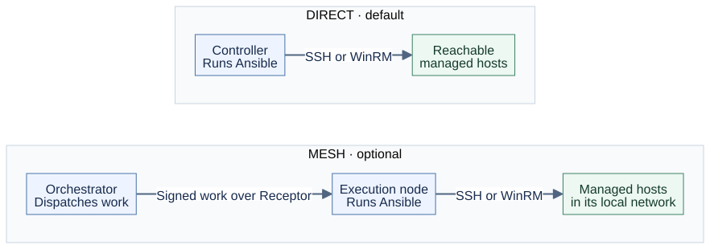

<div align="center">

<a href="https://buymeacoffee.com/pcileky2q"></a>
&nbsp;&nbsp;
<a href="https://github.com/sponsors/allamiro"></a>

<sub>Support maintenance, testing, and documentation. Sponsorship is optional.</sub>

<br><br>


# Ansible Controller

**Run Ansible playbooks in Docker, with your files on the host.**

[](https://github.com/allamiro/ansible-controller/actions/workflows/docker-image.yml)
[](https://github.com/allamiro/ansible-controller/actions/workflows/docker-publish.yml)
[](https://github.com/allamiro/ansible-controller/releases)
[](LICENSE)

[Detailed guide](docs/README.md) · [Architecture](docs/ARCHITECTURE.md) · [Mesh](mesh/README.md) · [GitLab integration](gitlab/README.md) · [Support](SUPPORT.md) · [Contact](SUPPORT.md#learn-more)

</div>

An Ubuntu 26.04 container with Ansible, OpenSSH, and Windows/WinRM support. Keep playbooks, inventory, and credentials on your machine and mount them into the controller. No host Ansible installation is needed. All three images below are published for **amd64 and arm64** on Docker Hub and as `ghcr.io/allamiro/<image-name>`.

## Choose how to run



| Image on Docker Hub | Purpose and where it runs |
|---|---|
| [ansible-controller](https://hub.docker.com/r/allamiro1/ansible-controller) | Standalone control host. Runs playbooks directly against reachable SSH or WinRM targets. |
| [ansible-orchestrator](https://hub.docker.com/r/allamiro1/ansible-orchestrator) | Mesh control host. Includes the controller runtime and dispatches signed jobs through Receptor ingress sidecars to execution nodes. |
| [ansible-execution-node](https://hub.docker.com/r/allamiro1/ansible-execution-node) | Inside each target network. Runs mesh jobs against local targets and connects outbound to the control host; no running SSH server. |

Use the standalone quick start below for the controller, or the [mesh guide](mesh/README.md) for the orchestrator and execution nodes. [GitLab integration](gitlab/MAINTAINER-README.md) is optional for either mode.

## Quick start

You need Docker Engine, Docker Compose 2.17 or newer, Git, and OpenSSH tools on the host. Run these commands from the repository root. Replace `192.0.2.10` and `deploy` with your server and SSH account.

**1. Clone and prepare an SSH key.** For existing keys or SSH agent forwarding, see the [detailed guide](docs/README.md#ssh-keys-for-managed-hosts).

```bash
git clone https://github.com/allamiro/ansible-controller.git
cd ansible-controller
mkdir -p ssh && chmod 700 ssh
ssh-keygen -t ed25519 -C "ansible-controller" -f ssh/id_ed25519 -N ""
ssh-copy-id -i ssh/id_ed25519.pub deploy@192.0.2.10
```

**2. Set your inventory** in `configs/inventory/hosts.ini`:

```ini
[all]
web01 ansible_host=192.0.2.10 ansible_user=deploy

[all:vars]
ansible_ssh_private_key_file=/home/ansible/.ssh/id_ed25519
```

**3. Build, start, and test connectivity.** The included Compose file builds the controller from this checkout.

```bash
docker compose up -d --build --wait
docker exec -it ansible-controller \
  ansible-playbook /configs/playbooks/ping.yml -e ansible_become=false
```

A successful run returns `pong`; this connectivity check does not require sudo. Add your own playbooks under `playbooks/`; they are available inside the container at `/configs/playbooks/`. The [full quick start](docs/README.md#quick-start) covers custom playbooks and the optional Make helpers.

### SSH host-key checking

The shipped configuration disables managed-host key verification for lab use. Before production, follow the [managed known-hosts procedure](docs/README.md#ssh-host-key-checking). Use `make preflight` (requires Make) to check readiness and `make preflight STRICT=1` to also flag risky settings. Container startup and `docker exec` run as root; SSH logins use the `ansible` account.

## GitLab: review, sync, then execute

GitLab CE can manage project review and deployment for either execution mode.
For mesh and the project template, the controller **syncs an exact commit without
running Ansible**, then a separate manual deployment executes the verified snapshot.
You can require a manual release before sync as well. These are voluntary operator
decisions about deployment, unrelated to sponsorship or fleet size.


Start with the [project lifecycle guide](docs/LIFECYCLE.md) to create a project,
connect its runners and environment, choose both approval gates, read reports,
and handle upgrades or recovery. The bootstrap seed's standalone `deploy-direct`
job combines fetch and execution; the reusable project template uses separate
sync and execution for either mode. GitLab remains optional.

## Common use cases

| Your situation | Start here |
|---|---|
| A workstation or one reachable server network | [Standalone quick start](#quick-start); edit mounted playbooks without rebuilding. |
| Branch offices, private networks, or several reachability zones | [Mesh setup](mesh/README.md); place nodes near targets and use separate environment inventories per zone. |
| A team needs reviewed Git changes and approval before sync and execution | [Project setup and approvals](docs/LIFECYCLE.md#create-an-automation-project). |
| A rollout affects 100+ inventory hosts | [Canary and batch rollout](docs/LIFECYCLE.md#roll-out-to-100-or-more-systems); pool selection does not split an inventory automatically. |
| Windows, cloud inventory, or encrypted credentials | [Controller reference](docs/README.md); provision dependencies and trust in the runtime that executes Ansible. |
| A job disconnected or its outcome is unclear | [Results and recovery](docs/LIFECYCLE.md#read-results-and-recover); collect the original job before considering another execution. |

## Documentation

| Guide | What you will find |
|---|---|
| [Detailed controller README](docs/README.md) | Images and tags, commands, Galaxy roles, cloud inventory, Windows, Vault, SSH, logs, and troubleshooting checks. |
| [Architecture and diagrams](docs/ARCHITECTURE.md) | Host mounts, direct execution, mesh connections, certificate enrollment, and the GitLab boundary. |
| [Project lifecycle and use cases](docs/LIFECYCLE.md) | Create projects, sync GitLab revisions, approve execution, roll out in batches, read reports, and upgrade. |
| [Mesh deployment](mesh/README.md) · [Runbook](mesh/RUNBOOK.md) | Execution nodes, redundant ingress, deployment, upgrades, and recovery. |
| [External CA](mesh/EXTERNAL-CA.md) | Use your organization's certificate authority for mesh identities. |
| [GitLab walkthrough](gitlab/MAINTAINER-README.md) | Project setup, permissions, reviewed commits, and manual deployments. |
| [Releases and image signatures](docs/README.md#versioning-and-releases) | Versioning, registry tags, and cosign verification. |

## License and support

This project's source is licensed under the **[Apache License 2.0](LICENSE)**. Bundled third-party software retains its own licenses.

The community controller and mesh are free to use with **no host limit or purchase requirement**. Sponsorship is voluntary. For deployment assistance, [contact the maintainer](mailto:tsuliman@linuxvaults.com?subject=Ansible%20Controller%20support%20enquiry) and see [SUPPORT.md](SUPPORT.md) for scope and terms. Sponsorship alone does not include a support contract or guaranteed response.

## Contributing

Bug reports, documentation improvements, and fixes are welcome. [Open an issue](https://github.com/allamiro/ansible-controller/issues/new/choose) before a PR, then follow the [contribution and validation instructions](docs/README.md#contributing).
