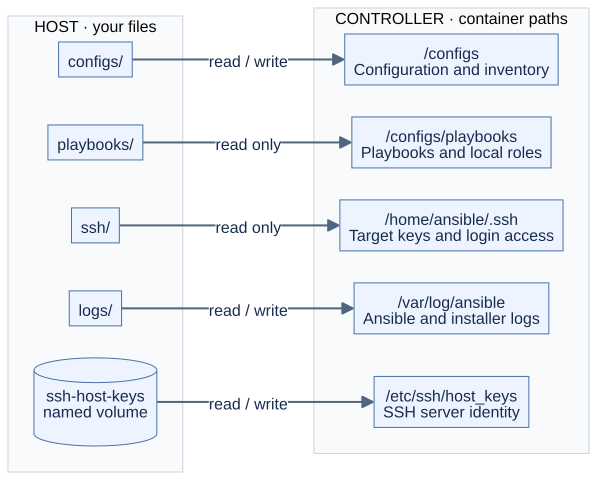
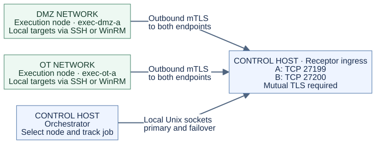
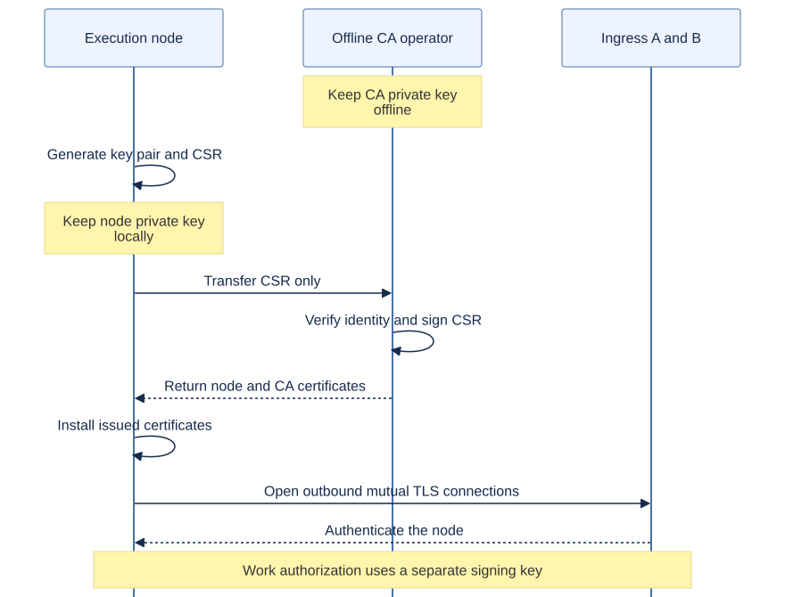

# Controller architecture

[Project overview](../README.md) · [Detailed guide](README.md) · [Mesh setup](../mesh/README.md) · [GitLab architecture](../gitlab/ARCHITECTURE.md)

## Where playbooks run

The standalone controller runs Ansible against targets it can reach. In mesh mode, the orchestrator dispatches work to an execution node that can reach the target network. GitLab is optional in both cases.

| Component | What it does | Where to configure it |
|---|---|---|
| Standalone controller | Runs playbooks locally and connects to managed hosts over SSH or WinRM. | [Compose](../docker-compose.yml), [Ansible configuration](../configs/ansible.cfg) |
| Mesh orchestrator | Selects an execution node, submits work through a local Receptor socket, and records results. | [Mesh guide](../mesh/README.md), [pools](../mesh/config/pools.yml), [zones](../mesh/config/zones.yml) |
| Receptor ingress A and B | Authenticate mesh peers and deliver signed work over established connections. | [Mesh Compose overlay](../mesh/compose.mesh.yml) |
| Execution node | Connects outbound to the ingress endpoints and runs Ansible inside its reachable network. | [Node Compose file](../mesh/compose.node.yml) |
| Managed hosts | Receive Ansible actions over SSH or WinRM; they do not join the Receptor mesh. | Your inventory and target credentials |

## Host files and persistent data

The default Compose layout keeps your project files and logs on the host. Playbooks and the SSH directory are mounted read-only. Configuration is writable so dependency installs and caches persist.

| Host source | Container path | Access | Purpose |
|---|---|---|---|
| `./configs` | `/configs` | Read/write | Ansible configuration, inventory, Galaxy content, caches, and optional Vault password file. |
| `./playbooks` | `/configs/playbooks` | Read-only | Your playbooks and local roles; this nested mount overlays that directory inside `/configs`. |
| `./ssh` | `/home/ansible/.ssh` | Read-only | Target private keys and optional controller-login `authorized_keys`. |
| `./logs` | `/var/log/ansible` | Read/write | Playbook and startup dependency-install logs. |
| `ssh-host-keys` named volume | `/etc/ssh/host_keys` | Read/write | The controller SSH server's identity across container recreation. |

Target login keys in `./ssh` and the controller's SSH server host keys are different credentials. The server keys are generated at first start. For target trust, follow the [known-hosts procedure](README.md#ssh-host-key-checking).

## Mesh connections and work delivery

Connection arrows below show **who opens the connection**. Each execution node connects outbound to both ingress endpoints: TCP **27199** for A and **27200** for B. The control host must accept those authenticated connections. Work travels back over the established connection; it does not require a new inbound connection into the target network.

The orchestrator submits through local Unix sockets. Mesh transport requires mutual TLS, while work signatures separately authorize execution. Nodes use SSH or WinRM to reach managed targets from their own networks.

Ingress redundancy protects admission of **new jobs** when one ingress is unavailable. It does not make the orchestrator host active/active. An interrupted result stream is recovered with `make mesh-collect JOB=<job-id>`; recovery does not silently run the playbook again. See the [recovery runbook](../mesh/RUNBOOK.md#resolve-an-ambiguous-submission).

## Identities and enrollment

The certificate authority's private key stays offline. An execution node generates its own private key and sends only a certificate signing request to the CA operator. After identity verification, the signed certificate and CA certificate return to the node.

The work-signing key is separate from the CA key: its private half is installed only on the control host, and its public half is distributed to execution nodes. Ingress identities are issued separately. Follow the [built-in PKI procedure](../mesh/README.md#step-1--issue-identities) or the [external CA guide](../mesh/EXTERNAL-CA.md).

## Optional GitLab integration

GitLab stores projects and provides review and manual deployment jobs. A CI job contacts the controller over restricted SSH. For mesh and the reusable project template, sync stages the selected commit; a separate manual execution verifies that snapshot without fetching Git again. Sync can have its own manual release. CI jobs do not connect directly to execution nodes or receive mesh private keys.

The [project lifecycle guide](LIFECYCLE.md) covers project creation, both approval gates, canary/batch rollouts, reports, recovery and runtime upgrades.

Native `make run`, `make mesh-run`, and `make mesh-collect` continue to work with local project files without GitLab. The [GitLab architecture guide](../gitlab/ARCHITECTURE.md) contains the detailed request, deployment, and recovery diagrams.

## Diagram sources

All diagrams on this page have editable Mermaid sources and checked-in SVG renders under [assets/diagrams](../assets/diagrams/README.md). The SVGs work in GitHub, Docker Hub, and Markdown viewers without Mermaid support.
