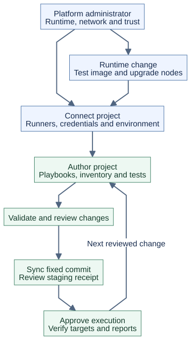
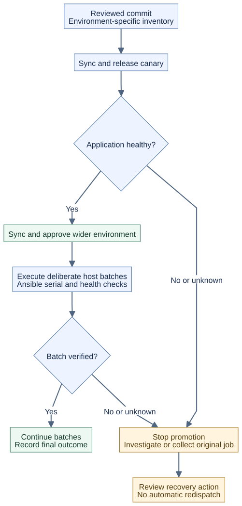

# Automation project lifecycle

[Project overview](../README.md) · [Architecture](ARCHITECTURE.md) · [GitLab setup](../gitlab/MAINTAINER-README.md) · [Mesh rollouts](../gitlab/MESH-ROLLOUTS.md)

Choose standalone execution when the controller can reach the targets. Choose
mesh execution when a node inside another network must reach them. Both support
SSH and WinRM with the appropriate runtime dependencies and credentials. GitLab
adds project review, sync, deployment jobs and reports to either mode.

## Separate platform setup from project changes



| What changes | Work required | Owner |
|---|---|---|
| A playbook, role, template or inventory in Git | Review, sync the new commit, approve execution, verify results. No controller image rebuild. | Project author and release operator |
| Which projects, inventories or mesh destinations an environment permits | Review the administrator environment map; start a new pipeline and sync again. Existing receipts reject a changed map. | Controller administrator |
| Python/system packages or Ansible runtime version | Build or select a tested runtime image, then roll it out to the controller or eligible nodes. | Platform maintainer |
| Mesh nodes, certificates or signing keys | Follow enrollment, rotation and upgrade procedures in the [runbook](../mesh/RUNBOOK.md). | Platform/PKI operator |

The platform is prepared once, then maintained independently. Ordinary automation
jobs do not recreate controllers, enroll nodes, or obtain CA/signing private keys.
Changing mounted playbooks in the native CLI workflow also needs no image rebuild.

## Create an automation project

1. Create an empty private GitLab project and copy
   [the project template](../gitlab/project-template/README.md), including hidden
   files. Its README gives the copy, initialization and push commands.
2. Replace the example target and the deliberately invalid CI image placeholder.
   Select a tested image reachable by both runners. Keep validation inventory
   separate from production credentials.
3. Have the controller administrator allow the exact project in the environment
   map and configure its inventory, credentials and execution destination.
   Provision the read-only Git fetch token on the controller and the restricted
   controller-login key and pinned host keys for CI. Follow the
   [connection procedure](../gitlab/MAINTAINER-README.md#3-connect-the-project-to-this-controller-host-administrator).
4. Bootstrap the initial commit, then protect `main` against direct pushes and
   require successful validation before Maintainer merge. Configure the validation
   runner separately from the protected deployment runner and variables.
5. For mesh, replace every `prod-direct` environment reference in the template
   with the administrator's mesh environment. Set `mode: mesh`, exactly one
   `node`, `pool` or `zone`, and `require_sync: true` in that environment map.
   The example map's `inventory/direct.ini` belongs to the lab seed: for the
   project template select `inventory/production`, including its sibling variables.

The project layout separates automation content from the platform repository:

```text
my-automation/
  .gitlab-ci.yml                 validation, sync and deployment jobs
  playbooks/site.yml            entry playbook
  playbooks/roles/              optional project roles and their files
  inventory/validation/hosts.ini  nonsecret validation fixture
  inventory/production/hosts    actual target inventory
  inventory/production/group_vars/  optional encrypted variables
  scripts/                     CI transport and report helpers
  tests/                       project/helper checks
```

Copying files does not provision runners, target accounts, Vault passwords, or
controller permissions. The bootstrap script preserves populated repositories;
it does not silently replace their pipelines. Keep credentials outside Git, except
deliberately Vault-encrypted variable files. See the template's
[credential instructions](../gitlab/project-template/README.md#password-credentials-with-ansible-vault).

## Review, approve sync, approve execution


The **mesh routes and reusable project template** use these steps:

1. Authors push a branch and open a merge request. Validation runs without
   deployment credentials. A Maintainer reviews code, inventory and CI changes.
2. After merge into protected `main`, **sync** requests the exact checked-out SHA.
   The controller fetches it into private staging and records a receipt identifying
   the commit, inventory, configured destination, pipeline and sync job. Sync does
   not execute Ansible, evaluate inventory plugins or install project dependencies.
3. Review the sync report. A separate manual **deploy** job verifies the staged
   bytes and environment mapping against that receipt, then executes without a
   second Git fetch. It records the execution job separately from the sync job.
4. Inspect execution status, reports and target health before the next rollout.

By default, review/merge authorizes automatic sync; execution is manual. For
**both manual gates**, replace the template's existing `sync.rules` with:

```yaml
# Within the existing sync job; retain its extends, environment and script.
rules:
  - if: '$CI_COMMIT_BRANCH == "main" || $CI_COMMIT_TAG =~ /^v/'
    when: manual
    allow_failure: false
```

Keep `deploy` manual and its `needs: sync` dependency. In the bootstrap seed,
apply the same manual settings to the existing rules of each required `sync-*`
job, preserving its source conditions. Its standalone `deploy-direct` route is
one manual fetch-and-run job; use the reusable template for separate gates there.

These buttons do not enforce two distinct approvers. CE uses protected refs,
runner/variable restrictions, trusted Maintainer review and manual release;
licensed approval policies are a separate configuration. See
[GitLab manual jobs](https://docs.gitlab.com/ci/jobs/job_control/) and
[the repository's approval boundaries](../gitlab/OPTIONAL-APPROVALS.md).
Native controller/mesh commands remain outside this GitLab approval policy.

The starter accepts push and merge-request pipelines; it does not automatically
enable schedules, API triggers or web-created pipelines. The full bootstrap seed
has additional routes, with manual release for all mesh executions. Choose either
a `main` or protected-tag pipeline for a deployment: each is a separate request,
even for the same commit. GitLab Runner starts CI jobs; `ansible-runner` executes
the mesh payload on the node. They are different programs.

## Roll out to 100 or more systems



Create a canary environment with a small inventory, verify real application health,
then approve the wider environment's pipeline. Each environment needs its own
administrator mapping and matching CI jobs; copying the starter does not create
these automatically. Within the wider play, Ansible `serial` can limit host batches;
the [rollout guide](../gitlab/MESH-ROLLOUTS.md#rolling-changes-across-100-systems)
shows `serial: [1, 5, "10%"]` with a failure threshold.

One selected node must reach every target in its job. A pool selects a candidate
node; it does not split one inventory across sites or execute on every node.
Use separate inventories/environments for separate reachability zones. Ansible
`forks` limits task concurrency, `serial` controls batches, and mesh admission
limits concurrent jobs per node. Project `resource_group` serialization does not
lock overlapping targets across different GitLab projects.

There is no charge or license gate at 100 systems. Report counts describe inventory
names, which may include aliases; they do not measure unique machines or customers.

## Read results and recover

Open the pipeline's Tests tab and deployment artifacts. The reports include commit
provenance, pipeline/job IDs, destination, known outcome and available recap totals.

| Evidence | What it tells you |
|---|---|
| Sync report/receipt | Content was staged; no target execution is implied. |
| `reports/summary.html` / `summary.json` | Human-readable or structured execution summary. Missing recap is unavailable data. |
| `reports/deployment.xml` | One aggregate operation/transfer result in GitLab Tests, not a test case for every host/task. |
| Controller record and mesh UUID | Correlates the request with the original mesh execution and recovery state. |
| `submit-ambiguous` / `results-incomplete` | Outcome needs investigation or collection; it is not success. |

A completed-request Retry returns the recorded result rather than rerunning it.
A new pipeline is a new execution request. Cancellation or an SSH disconnect does
not prove remote work stopped. Collect the original UUID using the
[recovery procedure](../mesh/RUNBOOK.md#resolve-an-ambiguous-submission) before
deciding whether another execution is appropriate. The full seed has a collection
job; the minimal project template relies on operator recovery.

Known playbook success with failed artifact transfer still fails the CI job.
No report after cancellation is not proof of completion. Summaries avoid raw task
objects and secrets, but execution logs can contain sensitive playbook output.
Review artifacts before sharing; default retention is seven days, subject to
GitLab's keep-latest behavior. Preserve authoritative controller/mesh state longer
when necessary to resolve outstanding work.

## Build, upgrade and retire

For local controller development, [build from source](README.md#build-from-source).
For deployment, select a tested published release and record its image digest.
Mesh images extend a digest-pinned controller base; node-specific Python/system
dependencies belong in a [site node image](../mesh/README.md#node-runtime-python-dependencies).
Controller startup installs do not populate execution nodes. Sync only stages
project bytes; it is not an image build or dependency installation job.

Upgrade controller integration scripts and existing project CI helpers together
using the [upgrade contract](../gitlab/MESH-ROLLOUTS.md#controller-contract-and-upgrade).
Bootstrap will not update already populated projects. Test the new runtime on a
small inventory before wider promotion. A Git revert changes future automation;
it does not undo changes already applied to targets. Recovery or rollback needs
its own reviewed playbook and target verification.

Before retiring a project, resolve outstanding jobs, retain required records,
remove its environment authorization, and revoke its fetch/deployment credentials
according to the site's policy. Mesh certificate/key retirement follows the
runbook; deleting a GitLab project or removing a node from a pool does not revoke
mesh identity. The separate [repository release process](README.md#versioning-and-releases)
publishes runtime images; it does not deploy your automation project to targets.
