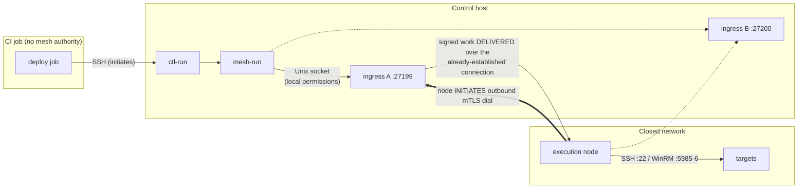
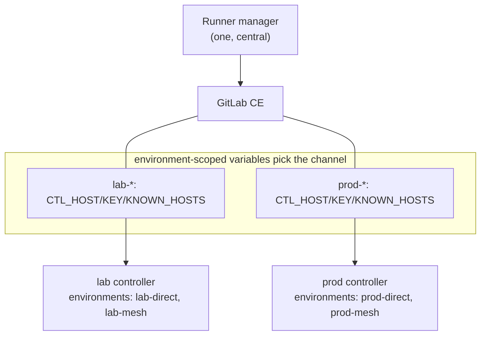
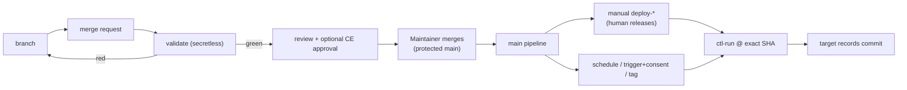
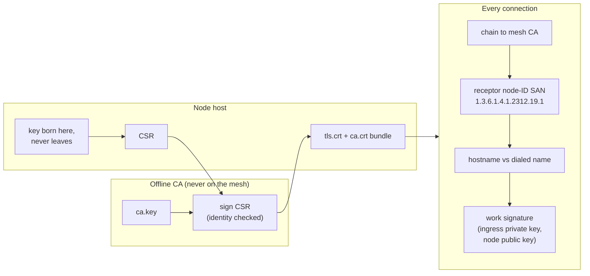
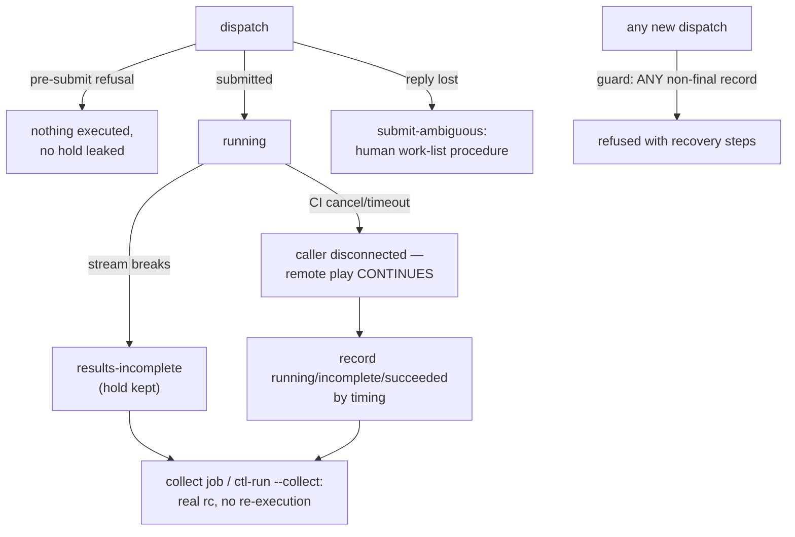
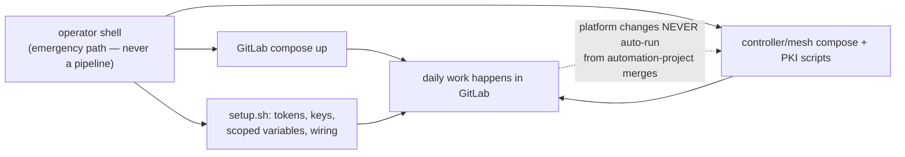

# GitLab-driven automation — architecture and evidence

**Current verification (2026-09-08):** read [VERIFICATION.md](VERIFICATION.md)
for the isolated GitLab CE 19.3.1 test results, fixes and explicit coverage gaps.
The older acceptance results below are historical. Full controller HA,
autoscaling, durable request deduplication and live Windows coverage are still
missing; the diagrams do not imply those capabilities are implemented.

The design of record for the GitLab CE integration: responsibilities, trust
boundaries, lifecycle, failure semantics, and the live evidence behind each
claim. Deployment lives in [README.md](README.md); the disposable lab that
exercises everything end to end lives in
[mesh/labs/gitlab/](../mesh/labs/gitlab/README.md).

## Required boundary: GitLab is optional

The original controller and mesh remain independently usable. GitLab adds an
optional source/review/CI interface; it is not the mesh scheduler, a required
runtime dependency, or a route to execution nodes.

- **Project content is pulled by the controller.** A deployment Runner job sends
  a request over SSH containing the environment, project, commit SHA and
  playbook name. It does not push the playbook payload to execution nodes.
  `ctl-run` then fetches that SHA from GitLab using a controller-held credential.
- **GitLab CE does not initiate controller or execution-node connections in
  this design.** Runner manager polls GitLab; its deployment job connects only
  to the controller. Deployment jobs need no node addresses, mesh sockets,
  signing keys or target credentials. Enforce that boundary with network policy
  as well as credential placement; Runner tags alone do not enforce it.
- **The controller owns execution.** For standalone operation it runs Ansible
  directly against SSH/WinRM targets. For mesh operation it submits signed work
  through its local Receptor ingress; nodes initiate outbound mTLS connections
  to the ingress and receive work over those established connections.
- **Without GitLab**, operators use the existing `make run` / `ansible-playbook`
  and `make mesh-run` / `mesh-run` paths with locally available project files,
  inventories and runtime credentials. Mesh recovery remains available through
  `make mesh-collect`. No GitLab token, Runner or `ctl-run` is needed for these
  paths. Installing GitLab must not replace or gate them.

When GitLab is unavailable, a new `ctl-run` request requiring a repository fetch
will fail. That does not prevent native execution using already provisioned
files. This is an explicit operator path, not an automatic fallback to an
unreviewed or stale checkout. Core Compose definitions and mesh execution must
continue to work without the optional GitLab override/network.

## Responsibilities

| Component | Owns | Never does |
|---|---|---|
| GitLab CE | source of truth, review (protected branches), pipeline initiation, results/artifacts presentation | contact the controller (initiates nothing outward) |
| GitLab Runner (manager) | polls GitLab, spawns job containers (docker executor) | hold mesh/target credentials |
| Validation jobs | syntax/lint on MRs and branches | touch secrets, sockets, or controllers |
| Deploy jobs (protected refs only) | SSH to a controller and invoke `ctl-run` | fetch/hold repo tokens, choose credentials, reach targets |
| `ctl-run` (controller-side command) | validate inputs, fetch the exact requested SHA (review is a CI governance assumption), stage in isolation, execute via existing engines, record audit linkage | be an API, accept caller-chosen URLs/credentials/modes, sandbox playbook content |
| Standalone controller | `ansible-playbook` against directly-reachable SSH/WinRM targets | — |
| Orchestrator + ingress A/B | mesh dispatch (`mesh-run`), work signing, result streaming | expose sockets beyond local permissions |
| Execution nodes | run received payloads against their networks' SSH/WinRM targets | clone from GitLab, hold fetch tokens |

**GitLab Runner ≠ ansible-runner**: the former executes pipeline scripts;
the latter packages/streams Ansible work inside the mesh payload. They meet
nowhere.

## 1. Standalone execution (SSH + WinRM targets)

```mermaid
sequenceDiagram
    participant Dev as Developer
    participant GL as GitLab CE
    participant R as Runner job (protected ref)
    participant C as Controller (ctl-run)
    participant T as Targets
    Dev->>GL: MR -> review -> merge to protected main
    R->>GL: poll; job for merge commit SHA
    R->>C: SSH (pinned host key, forced command)<br/>ctl-run --env prod-direct --sha SHA
    C->>GL: fetch SHA (read-only deploy token)
    C->>C: stage /var/lib/gitlab-runs/<env>/<sha>/<run>/
    C->>T: ansible-playbook — SSH :22 / WinRM :5986(https)|:5985
    T-->>C: task results
    C-->>R: real rc (job status) + run record
```

## 2. Mesh execution — connection initiation vs work delivery



Initiation and delivery run in opposite directions: nodes dial out once;
work rides those established, mutually-authenticated connections inward.

## 3. Multiple controllers and Runner placement



One central Runner reaches every controller its jobs can SSH to; per-network
Runners only when connectivity or trust demands it (a control-host Runner is
the fully-local variant). **Tags schedule; they never authorize** —
authorization is the protected-ref runner + each controller's own
`environments.yml` allowlist + per-env credentials it alone holds.
Live-proven: `lab-*` and `prod-*` scopes drive two controllers from one
project (a variable collision between them was found and fixed by exactly
this scoping).

## 4. Project lifecycle



CE tier honesty (verified against current docs): approvals exist but only
Premium can *require* them. Enforced controls: protected branch
(push=no one, merge=Maintainers — dev1's merge attempt returned HTTP 401),
pipelines-must-succeed (red MR refused merge even for root, HTTP 405),
ref-protected deploy runner (branch deploy jobs sit `runner=NONE`),
protected+scoped variables, manual release buttons.

## 5. CA issuance and runtime verification



Live evidence for M3: the single-box node initially failed with
`certificate is valid for controller-a, receptor-controller, not
host.docker.internal` — controller certs must carry the DNS name nodes
dial, exactly as EXTERNAL-CA.md prescribes; re-issuing with that SAN fixed
it. GitLab's own TLS mode (public CA / internal CA / pinned self-signed /
reverse-proxy termination / lab HTTP) affects only the GitLab hops and
never substitutes for any of this.

## 6. Failure, cancellation, recovery



`ctl-run` adds a per-environment lock and inherits the lab-proven guard: a
GitLab retry can never silently duplicate an operation whose outcome is
unknown. A UUID is not exactly-once; reconciliation demands proof
(staleness + slot-flock liveness + quiescence + unit-state probes) before
any record transition.

## 7. Platform bootstrap and maintenance



A stopped GitLab, Runner, or mesh cannot repair itself through its own
pipelines; `setup.sh`/`lab-up.sh`/compose remain the operator-owned
bootstrap and break-glass path. Playbook merges execute playbooks — they
never recreate the controller or touch PKI.

## Connection matrix

| # | Source → Destination | Initiator | Protocol/port | Authentication | Verified by / trust store | Credential owner |
|---|---|---|---|---|---|---|
| 1 | browser/git → GitLab | client | HTTP(S) :8929* | password/PAT/session | client CA store (TLS modes A–D) | user |
| 2 | Runner manager → GitLab | runner | HTTP(S) | runner token | runner config CA (`tls-ca-file`) | admin |
| 3 | job container → GitLab | job | HTTP(S) | CI_JOB_TOKEN | job image trust | GitLab (ephemeral) |
| 4 | deploy job → controller | job | SSH :22 (in-network) | ed25519 file variable (env-scoped, protected) | PINNED host key (CTL_KNOWN_HOSTS), forced command | admin via setup.sh |
| 5 | ctl-run → GitLab | controller | HTTP(S) | read-only deploy token (`<user>:<token>`) | controller-side config | controller file, root-provisioned |
| 6 | mesh-run → ingress | controller | Unix socket | filesystem permissions | local ownership = submission authority | platform |
| 7 | node → ingress A/B | node | TCP 27199/27200 outbound | mesh mTLS both ways | mesh CA + node-ID SAN + dialed-name SAN; work signature on delivery | mesh PKI |
| 8 | controller/node → SSH target | executing runtime | SSH :22 | per-env key from environments.yml | known_hosts where Ansible runs | admin |
| 9 | controller/node → WinRM target | executing runtime | HTTPS :5986 (preferred) / HTTP :5985 | NTLM (Kerberos needs extra libs); creds via Vault vars | CA trust where Ansible runs; `ansible_winrm_server_cert_validation=validate` | admin/Vault |

\* GitLab TLS modes: **A** public CA (client stores already trust), **B**
internal CA (install in Runner `tls-ca-file`, job images, controller — each
hop separately), **C** pinned self-signed (same placement, explicit single
cert, evaluation only), **D** reverse-proxy termination (backend hop may be
plaintext — declare it), **E** plain HTTP (this lab: no transport
encryption or server verification on GitLab hops — disposable, isolated
use only; SSH hops (4, 8) stay encrypted regardless, and Git-over-SSH would
not protect the Runner's HTTP API traffic either).

## Alternatives considered

| Alternative | Why not here |
|---|---|
| Controller HTTP API / webhook receiver (AWX/AAP shape — cf. the Red Hat AAP+GitLab pattern) | an always-on network submission surface duplicating what an SSH forced command does for one command; AAP is the commercial product when a full API platform is actually required |
| Run ansible inside CI jobs (common IaC pattern) | right for secretless validation (our validate stage does exactly this); as the execution path it moves target credentials into CI, bypasses mesh signing/admission/never-run-twice, and loses central audit |
| `ansible-pull` on targets | inverts the wrong edge: git+ansible on every target, every target reaching GitLab, no central results, no mesh signing; our controller-side fetch already captures pull's benefit at the trust point that has it |
| One Runner per controller | unnecessary: one central manager + env-scoped channel variables reach any controller its jobs may SSH to |

## Acceptance matrix (this integration's runs; the lab README carries the base lifecycle matrix)

| Case | Result | Evidence |
|---|---|---|
| Input rejection (env/sha/traversal/project/metachars) | PASS | five refusals, exact messages |
| Forced command blocks shell/`bash`/`$(id)` | PASS | `ctl-shell` refusals |
| Standalone run, real controller, exact SHA | PASS | target records `commit=297ed2ac…` |
| Mesh run, real control plane + single-box node | PASS | `EXECUTED-ON=<node>`, rc=0, mesh job `e4b9888a…` |
| Wrong-SAN controller cert refused by node | PASS (negative) | receptor TLS error naming the SANs |
| Pipeline-level deploy via SSH channel | PASS | job 70: fetch `93746496…` → mesh rc=0 |
| Env-scoped variables select the right controller | PASS | lab-*/prod-* coexisting; collision fixed |
| Audit chain both directions | PASS | mesh meta `gitlab{…}` + run record `mesh_job` |
| Real ansible rc across CI | PASS (lab matrix) | fail.yml → rc=2 → job failed |
| Cancellation = disconnect only | PASS (lab matrix) | remote completion after cancel |
| Guard vs CI retry; reconcile; ambiguous verdicts | PASS (lab matrix) | live forced cases |
| WinRM execution | **UNTESTED** | no Windows host. Transport (pywinrm/NTLM) verified in both images; a real mesh run additionally needs `ansible.windows` staged via a `galaxy_dir` env and the Vault password provisioned to the EXECUTING runtime (node) — pattern documented, unexercised |
| Submodules / LFS projects | REFUSED by design | explicit errors |
| GitLab TLS modes B–D | See current verification | private CA + proxy termination exercised in gitlab-audit; self-signed leaf and end-to-end upstream TLS remain untested |

## Production gaps

Enforced multi-approver review (Premium or external gating), HTTPS GitLab
(mode A/B) with per-hop trust installation, a real Windows target to execute the WinRM path (including ansible.windows
staging via galaxy_dir and node-side Vault password provisioning), Vault-based target credentials end to end
(pattern documented, not exercised), controller host-key rotation
procedure for the pinned CI known_hosts, retention policy for
`/var/lib/gitlab-runs` records beyond the keep-last-5 staging trim, and
site decisions on which projects each environment allowlists.

Two known limitations of the current mesh path:
**mesh project-root staging** — `mesh-run` stages the playbook's *directory* as
the project root (roles/templates/files that are siblings of the playbook travel;
repo-root `roles/`, `collections/`, `group_vars/`, or a root `ansible.cfg` fetched
at the SHA do **not**). Mesh projects must therefore keep a self-contained playbook
layout, or a follow-up must teach `mesh-run` to stage an explicit project root
distinct from the playbook. **Bootstrap PAT lifecycle** — the root `api` PAT is now
self-revocable after wiring via `REVOKE_BOOTSTRAP=1 gitlab/setup.sh <url>`, but the
operator must actually run it; it is not automatic on completion.
