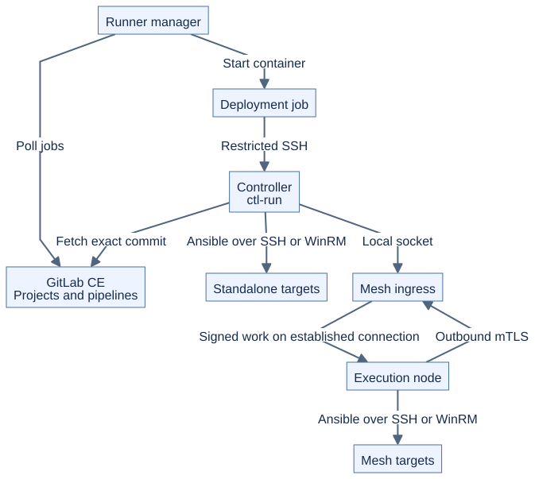
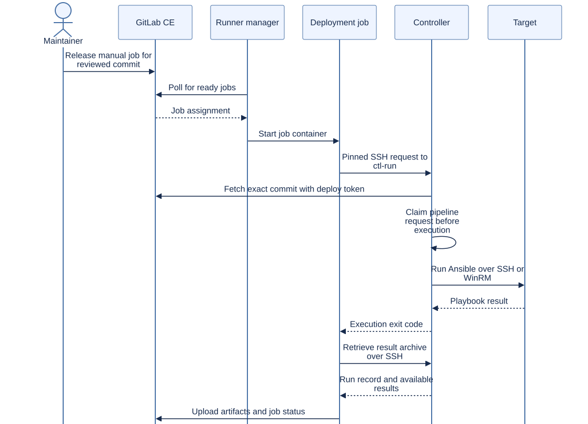
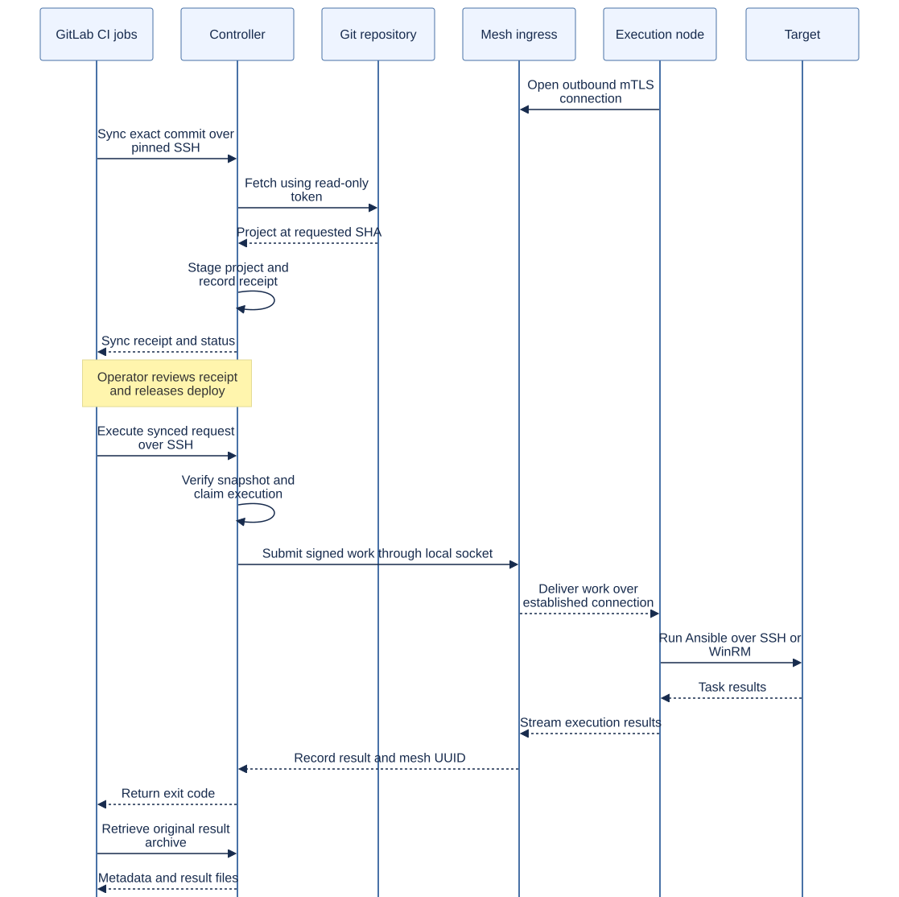
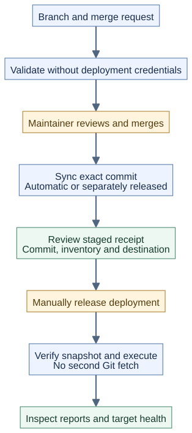
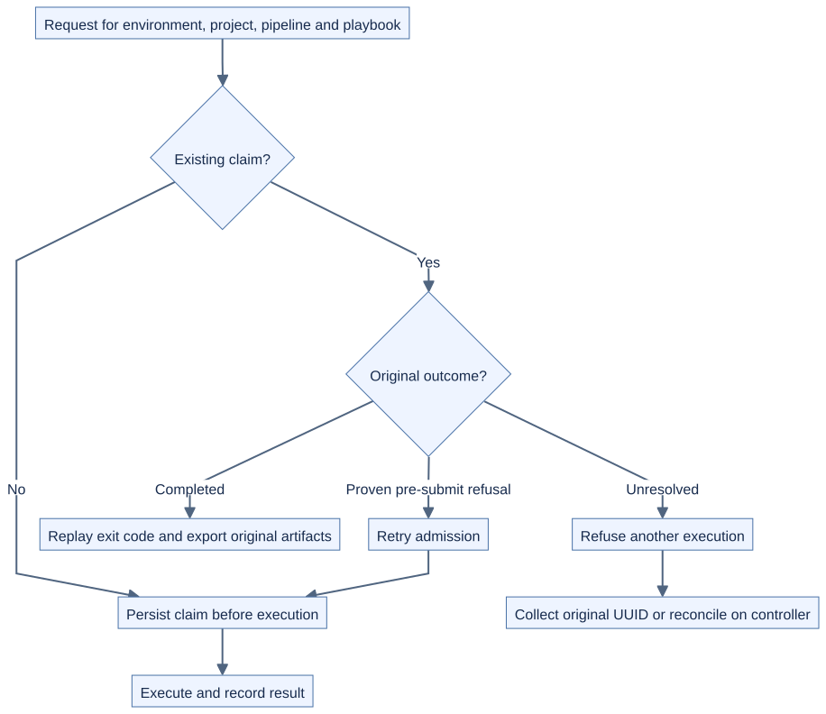

# GitLab Community Edition architecture

GitLab stores automation projects and coordinates review and manual release.
The controller fetches the reviewed commit and runs Ansible directly or through
its Receptor mesh. Start with the [Maintainer guide](MAINTAINER-README.md) for
login, project setup and everyday use. [Verification](VERIFICATION.md) lists
what has been tested.

## Required boundary: GitLab is optional

Native `make run`, `make mesh-run` and `make mesh-collect` remain available with
local project files and runtime credentials. A GitLab outage prevents new
repository fetches through `ctl-run`; it does not disable those native paths.
There is no automatic fallback to an older checkout.

GitLab Runner is the service that polls GitLab and starts CI job containers.
`ansible-runner` is used inside mesh work to execute Ansible and collect results.
They have different responsibilities.

| Component | Responsibility | Credential boundary |
|---|---|---|
| GitLab CE | Projects, merge requests, pipelines and artifact presentation | Stores protected, environment-scoped CI variables |
| Runner manager | Poll GitLab and start job containers | Holds its runner token and Docker executor socket |
| Validation job | Syntax-check and lint project content | Receives no deployment key or mesh mounts |
| Deployment job | Invoke `ctl-run` over pinned SSH and retrieve results | Holds only the restricted controller-login key for deployment |
| Controller | Fetch a commit, validate the environment mapping, track requests and execute | Holds repository fetch and target credentials |
| Receptor ingress | Accept local submissions and deliver signed work | Holds mesh identity and work-signing material |
| Execution node | Receive work and run Ansible against reachable targets | Holds its mesh identity and runtime target trust |

The job's normal GitLab checkout uses `CI_JOB_TOKEN`. The controller fetches
independently with a read-only deploy token. These credentials are separate.
Deployment jobs receive no mesh TLS keys, signing keys, mesh sockets or target keys.

## Standalone execution

The controller uses its administrator-owned environment mapping to choose the
inventory and credentials. It runs Ansible from the fetched project root.
The restricted SSH command returns the exit code; the CI helper retrieves the
run record for the GitLab artifact browser.

## Mesh execution

Execution nodes initiate outbound mTLS connections to the ingress. Signed work
travels back over those established connections. The CI job connects only to
the controller, which submits through its local Unix socket.

The entire fetched project is staged for mesh execution, including root-level
roles, collections and configuration. Repository paths referenced by Ansible
configuration must still be valid in the executing runtime.

## Review and manual release in CE

Bootstrap protects `main` with push disabled and merge allowed for Maintainers,
requires a successful validation pipeline, and configures protected deployment
runners and variables. A Maintainer releases the chosen manual deployment job.
Schedules and API triggers also produce manual deployment candidates.

CE records MR approvals, but a required reviewer count is not part of this
workflow. Maintainers who can merge CI configuration or change project policy
are trusted release operators. Runner tags select jobs; tags alone are not
an authorization boundary.

## Retries, artifacts and recovery

The request identity combines environment, project, pipeline ID and playbook
path, and binds them to a commit. The controller writes a durable claim before
execution. A job Retry reuses that identity; a new pipeline creates a new request.

- A completed request returns its original exit code without executing again.
- A proven pre-submission refusal can attempt admission again.
- An unresolved request requires collection or operator reconciliation.
- `collect` retrieves the original mesh result; it does not dispatch a playbook.

CI cancellation can disconnect the caller while remote work continues. Check
the original UUID before taking any further action. If submission was ambiguous
and no unit identity is known, investigate the ingress and target state; absence
from one work list is not proof that nothing ran.

Artifact retrieval uses `ctl-run --artifacts` over the same restricted SSH key.
It exports run records, available console logs and whitelisted mesh result files.
It excludes staged repositories, credential directories and symlinked files.
Downloads are restricted to Maintainers and expire after seven days by default.
A failed export cannot turn a failed playbook into a successful CI job.

Preserve `/var/lib/gitlab-runs/requests/` and its corresponding records on
persistent storage. Removing claims removes retry protection. This state belongs
to one controller; it is not a distributed lease or an HA scheduler.

## Connection matrix

| Connection | Initiator | Transport | Authentication and trust |
|---|---|---|---|
| Browser or Git client → GitLab | User client | HTTP/S, lab port 8929 | User session or repository-scoped token; client CA trust for HTTPS |
| Runner manager → GitLab | Runner | HTTP/S | Runner authentication token and runner CA trust |
| Job checkout → GitLab | Job/helper | HTTP/S | Ephemeral `CI_JOB_TOKEN` and checkout-helper CA trust |
| Deployment job → controller | Job | SSH 22 within the Docker network | Protected file key, pinned `CTL_KNOWN_HOSTS`, forced `ctl-shell` command |
| Controller fetch → GitLab | Controller | HTTP/S | Read-only deploy token and controller CA trust |
| Mesh dispatcher → ingress | Controller | Local Unix socket | Filesystem ownership grants submission authority |
| Node → ingress A/B | Node | TCP, host ports 27199/27200 | Mesh CA, node identity and dialed-hostname validation |
| Executing runtime → SSH target | Controller or node | SSH 22 | Target key and known-hosts verification at the runtime |
| Executing runtime → Windows target | Controller or node | Prefer WinRM HTTPS 5986 | Windows credentials, collections, Vault material and target CA trust |

## Certificate and credential placement

GitLab HTTPS, controller SSH, target SSH/WinRM and mesh mTLS are separate trust
relationships. Configure CA trust for the Runner manager, checkout helper and
controller independently when using a private GitLab CA.

Ingress certificates must include the DNS name nodes actually dial. Nodes
verify that name and the mesh identity; work signatures provide a separate
check on submitted work. CA private keys remain with the certificate issuer.

A `galaxy_dir` mapping stages collections such as `ansible.windows`. It does not
provide a Vault password: provision Vault material to the executing controller
or node separately. Live Windows execution remains outside current test coverage.

## Controller placement and maintenance

One Runner manager can serve jobs that reach multiple controllers, provided
network routes, scoped CI variables and each controller's allowlists are
configured independently. Separate controllers do not share request claims.
Do not put them behind a load balancer and assume retries are deduplicated across
hosts. Bootstrap's fixed runner names and local token files also require
explicit administration when adding projects.

Platform maintenance stays on the host: Compose, PKI scripts and `setup.sh`
configure the services. Routine automation-project merges do not automatically
upgrade GitLab, rotate keys or reconfigure the mesh. Reviewed playbooks still
execute with real runtime privileges; `ctl-run` is not a sandbox for their content.
