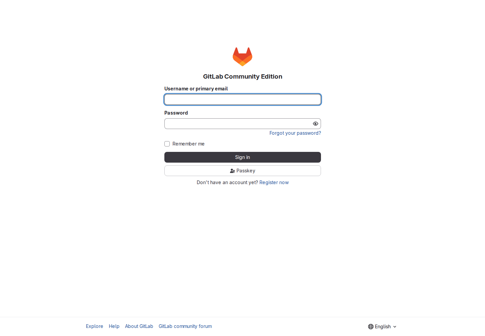
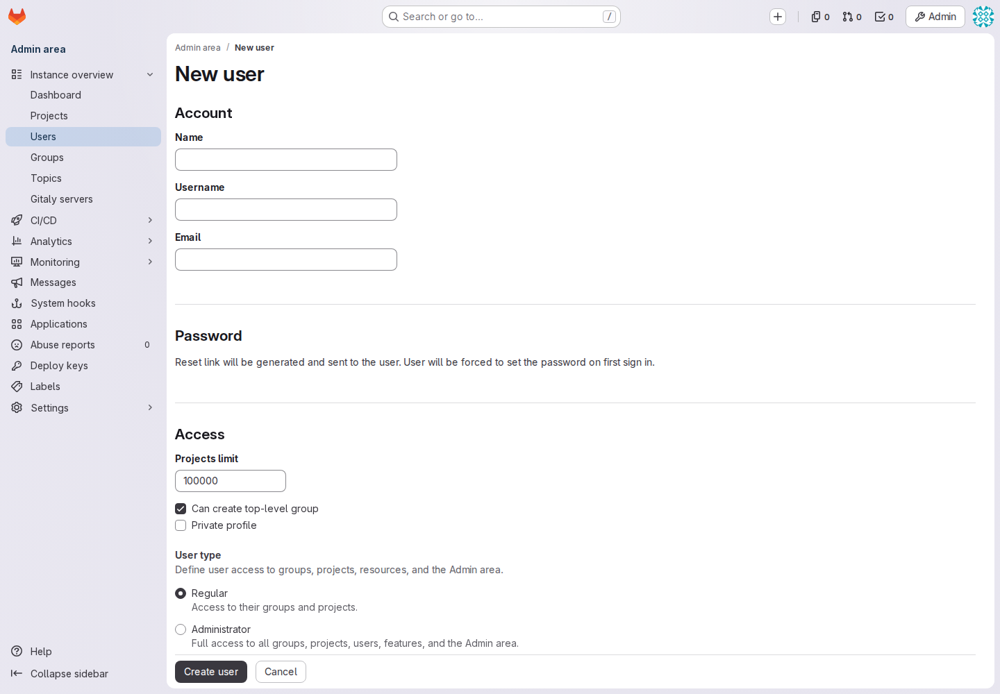
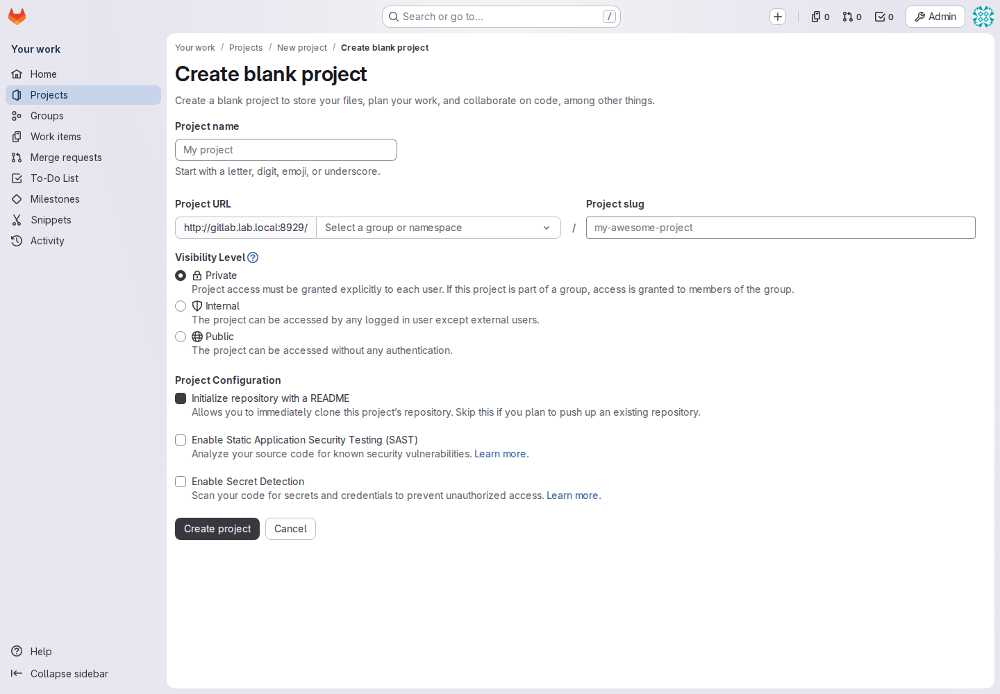
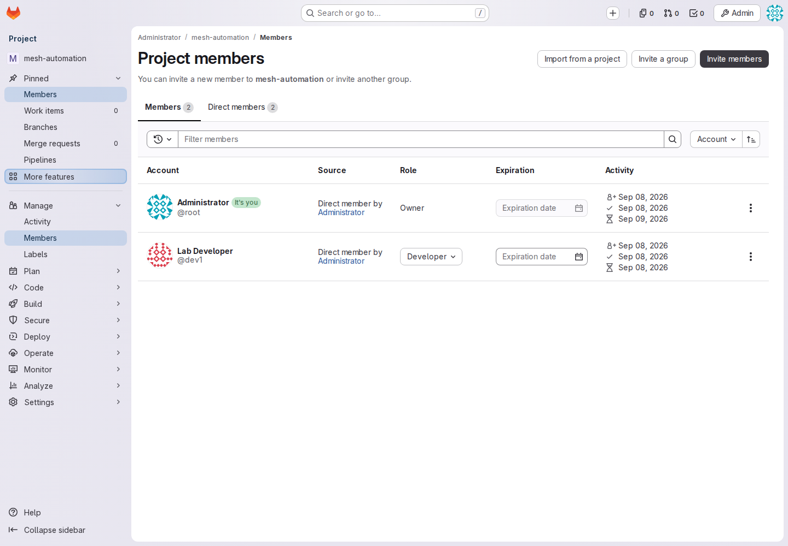
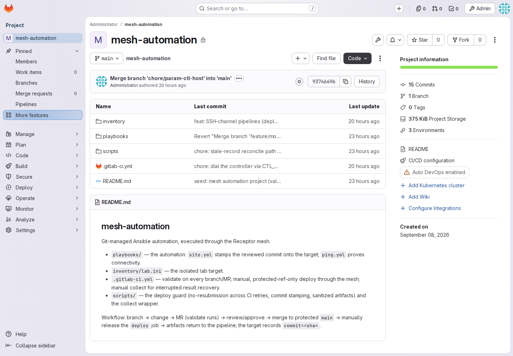
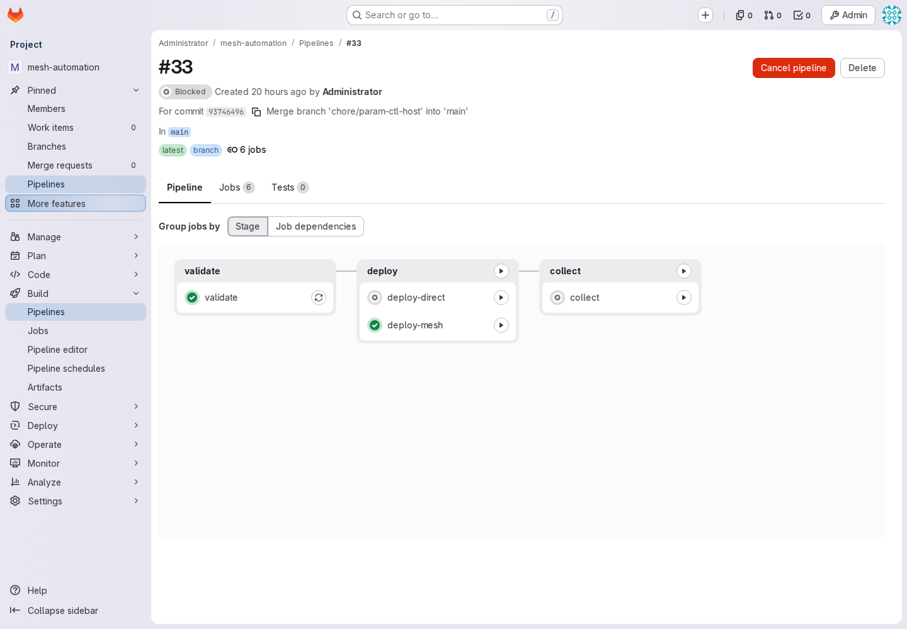
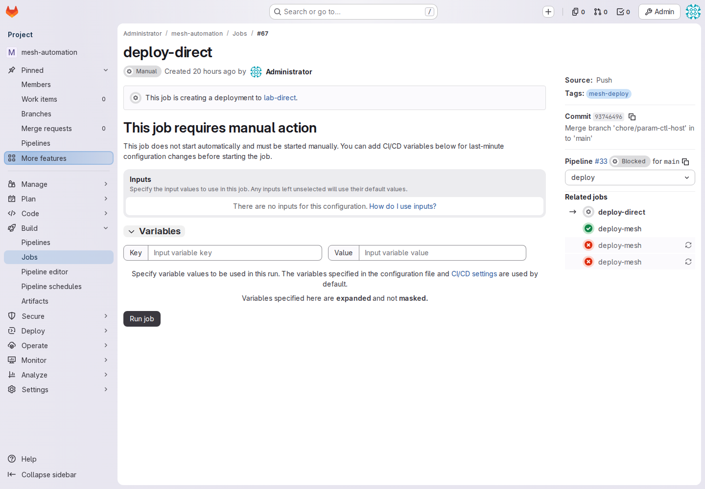
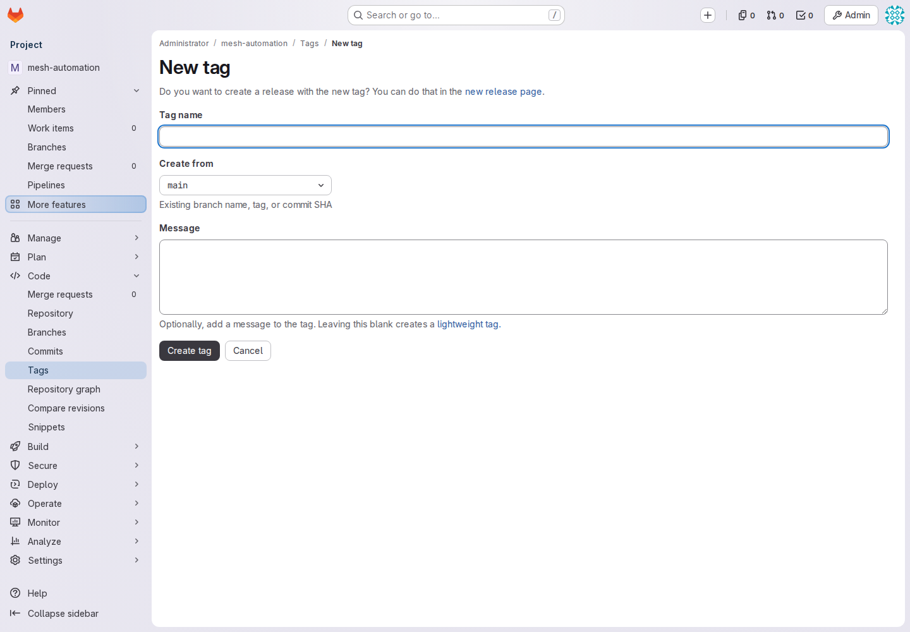
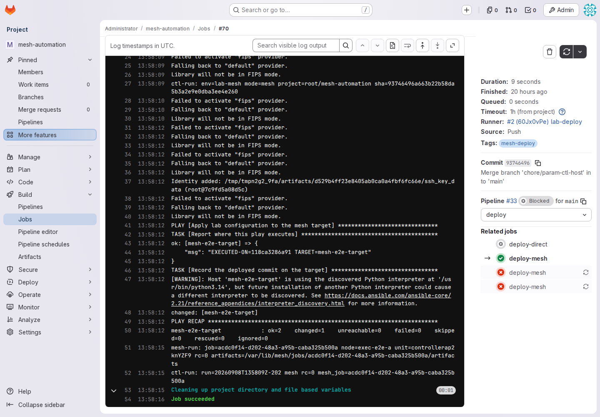

# GitLab CE: from first login to Ansible results

Use this walkthrough for accounts, project files, Vault credentials, review and
manual execution. The screenshots are from the running disposable GitLab CE lab,
captured on 2026-09-09. Click any image to enlarge it. They show real existing
pages, not proof that the new-project or credential setup steps have been run.
Admin screenshots show the bootstrap account; daily work should use named users.

## 1. Start or reuse GitLab — host administrator

If you already see `root/mesh-automation` at <http://localhost:8929>, reuse it.
Do not start a second stack. On another workstation, replace `localhost` with the
Docker host's reachable name and ensure `gitlab.lab.local` resolves there.

For a **new disposable lab only**, follow the prerequisites in the
[lab installation guide](../mesh/labs/gitlab/README.md#start-the-disposable-lab),
then run from the controller repository root:

```bash
mesh/labs/gitlab/lab-up.sh
```

This creates disposable mesh test resources as well as GitLab, Runner and the
controller extension. For a shared installation, follow the initial image,
private-state and Compose startup commands in [compose.gitlab.yml](compose.gitlab.yml),
then [connect the controller](MAINTAINER-README.md#3-connect-the-project-to-this-controller-host-administrator).
Use the site's HTTPS address for shared use. The lab's HTTP URLs are examples.

## 2. Sign in and create named accounts — administrator

Open <http://localhost:8929/users/sign_in>. For first administration, use `root`
and the initial password stored privately in `mesh/labs/gitlab/.lab-state/lab.env`.
If it has been changed in GitLab, use the changed password. Do not copy that file
into your automation project.



1. Open **Admin → Users → New user**.
2. Create a named release operator, for example `release-operator`, with the
   person's name, username and email. Select **Regular**, not Administrator.
3. Create a named playbook author, for example `automation-developer`, the same way.
4. Complete password setup using the instance's configured reset-email flow.
   The lab may not have outgoing mail: in that case the administrator must set an
   initial password through the user's admin edit page and deliver it privately.
   Verify login and any required password change before assigning daily work.
5. Keep the bootstrap root account for administration. The lab already has a
   Developer account named `dev1`; it is not a Maintainer automatically.



These are **GitLab accounts**. They do not create Linux/Windows target accounts
and their passwords are not Ansible deployment credentials.

## 3. Create a project and assign roles — group Owner and Maintainer

Use `platform/automation` as an example for a new project. A group Owner first
creates the `platform` group and permits the intended user to create projects.
Maintainer access to one project does not grant creation rights in every group.

1. Sign in with the named account permitted to create projects.
2. Select **New project → Create blank project**.
3. Enter `automation`, select the intended namespace, and choose **Private**.
4. Clear **Initialize repository with a README** if the host bootstrap will seed
   the empty project. Create the project.
5. Open **Manage → Members → Invite members**. Select the existing named release
   operator with role **Maintainer**, and the author with role **Developer**.
6. Check the membership list. Avoid sending invitations to arbitrary email
   addresses when the account already exists; select its username.





The membership screenshot is the existing lab, not the proposed named-user setup.
For the existing `root/mesh-automation`, add a named Maintainer there rather than
creating a duplicate project just to follow the screenshots.

## 4. Connect the project — host administrator

Complete [the controller connection procedure](MAINTAINER-README.md#3-connect-the-project-to-this-controller-host-administrator)
for the chosen project. It contains the network settings, private bootstrap token
storage and `gitlab/setup.sh` invocation. Run setup for the intended installation;
its fixed runner names and existing token files are not a multi-project onboarding
loop. Additional projects need deliberately assigned runners, project-specific
fetch authorization, CI variables and controller allowlists.

Before handing the project to developers, verify:

| Configuration | Required relationship |
|---|---|
| Controller environment map | Allows the exact project namespace/path and selects its inventory |
| Fetch deploy token | Controller can read that private project |
| CI connection | `CTL_HOST`, protected File `CTL_SSH_KEY` and `CTL_KNOWN_HOSTS` match the controller |
| Variable scope | Matches the job environment, such as `lab-direct` or `prod-direct` |
| Runner | Validation runner online; deployment runner protected with tag `mesh-deploy` |
| Branch protection | `main`: no direct pushes, Maintainers may merge; successful pipeline required |
| Release protection | `v*`: creation restricted to Maintainers |

The current lab's `lab-direct` uses `inventory/direct.ini`; `lab-mesh` uses
`inventory/lab.ini`. Uploading another inventory file does not select it: the
administrator must update the corresponding map. `deploy-direct` runs Ansible
on the controller; `deploy-mesh` runs it on the selected execution node.

A populated GitLab project is not overwritten by bootstrap. Apply the current
`.gitlab-ci.yml` and `scripts/ctl-ci.sh` from
`mesh/labs/gitlab/project-seed/` together through a reviewed change, preserving
site-specific image names, environments and playbooks. The controller must also
run the matching implementation. The photographed lab still uses an older
pipeline: job #70 has console output but no downloadable result archive, and
protected tags had not been configured at the time of capture.

## 5. Upload the playbooks and inventory — Developer

Clone the automation project using **Code → Clone with HTTPS** and your site's
Git credential manager. For Git-over-HTTP authentication, use a personal access
token with repository-write scope when required, entering it through the credential
prompt; do not embed a token in the clone URL. The lab's advertised SSH port can
conflict with the controller SSH endpoint, so verify any SSH clone endpoint first.

In the cloned **automation project**, create a branch:

```bash
git switch -c feature/deployment-inventory
```

Keep a structure like this (the Vault file is encrypted):

```text
.gitlab-ci.yml
scripts/ctl-ci.sh
playbooks/site.yml
playbooks/ping.yml
inventory/production/hosts.ini
inventory/production/group_vars/deployment/vault.yml
inventory/validation/hosts.ini
```

Encrypted variables belong in `group_vars` beside the inventory, and the
administrator's environment map must then select that **directory**
(`inventory: inventory/production`), not a single file. Mesh dispatch stages a
file inventory as that one file and leaves its sibling `group_vars` behind; see
[the credential procedure](MAINTAINER-README.md#one-time-target-credential-setup).
Keep the nonsecret validation inventory in its own directory so syntax and lint
checks never need the Vault password.

For example, `inventory/production/hosts.ini` can contain:

```ini
[deployment]
app01 ansible_host=192.0.2.10
```

Replace the documentation IP with a reachable target, and have the operator
verify its SSH host key. Add a non-mutating first playbook:

```yaml
---
- name: Check deployment connectivity
  hosts: deployment
  gather_facts: false
  tasks:
    - name: Verify Ansible can connect
      ansible.builtin.ping:
```

Save it as `playbooks/ping.yml`. This is an Ansible module connection check, not
an ICMP ping; a Linux SSH target normally needs Python. Update the chosen job's
`PLAYBOOK` and validation entry points through review if using different paths.



Use a local clone for Vault editing. The Web IDE is suitable for nonsecret code
changes; do not enter plaintext passwords there and encrypt them in a later commit.

## 6. Save target credentials with Ansible Vault — credential owner and operator

Here **Vault means Ansible Vault file encryption**, not a separately deployed
HashiCorp Vault server. No additional Vault web service is needed.

1. Have the target administrator provision an automation account such as
   `svc_ansible`, with the required target permissions.
2. On your trusted workstation, inside the automation project, run:

   ```bash
   mkdir -p inventory/production/group_vars/deployment
   ansible-vault create inventory/production/group_vars/deployment/vault.yml
   ```

3. Set a Vault encryption password at the local prompt. In the editor enter:

   ```yaml
   ansible_user: svc_ansible
   ansible_password: "REPLACE_WITH_TARGET_PASSWORD"
   # Include only if sudo requires it:
   ansible_become_password: "REPLACE_WITH_SUDO_PASSWORD"
   ```

4. Save the editor. The resulting file must begin with `$ANSIBLE_VAULT;`.
   Commit only that encrypted file. `ansible_become_password` does not enable
   privilege escalation; configure `become: true` on the appropriate plays/tasks.
5. The host operator provisions the same Vault password to the executing runtime,
   following [the runtime provisioning instructions](MAINTAINER-README.md#one-time-target-credential-setup).
   Standalone uses the controller entrypoint's `/configs/.vault_pass` source;
   mesh needs a separately mounted node-local password file and Ansible config.
   The lab extension's mounts must be configured explicitly; a password file in
   the main controller's host directory does not automatically reach that extension.
6. Adapt syntax/lint validation to a nonsecret fixture inventory before merging
   encrypted inventory. Verify validation without production decryption access,
   then have the operator verify real authentication with the connectivity play.

The group name `deployment` must match the inventory. Confirm with the
administrator that the environment map names the inventory **directory**: with a
single file selected, mesh execution stages the file alone, the encrypted
variables never reach the node, and the play connects with no username or
password instead of failing loudly. Standalone execution reads the fetched tree
in place and finds them either way, so a file selection can look correct until
the same project runs through the mesh. Different environment credentials should
be scoped to their inventory/groups, not placed in shared `group_vars/all`
accidentally. Use `ansible-vault edit` for later changes, and
coordinate target password rotation. Never print decrypted variables in job logs.

## 7. Push, review and merge — Developer then Maintainer

Stage only the intended automation files, read the staged content for accidental
plaintext secrets — the Vault file must appear as `$ANSIBLE_VAULT;` ciphertext,
not as readable variables — then commit and push your branch:

```bash
git add playbooks/ping.yml inventory/production/hosts.ini \
        inventory/production/group_vars/deployment/vault.yml
git diff --cached --stat   # which files are staged
git diff --cached          # their actual content — read it for plaintext secrets
git commit -m "Add deployment inventory and encrypted credentials"
git push -u origin feature/deployment-inventory
```

Include any reviewed CI/validation changes explicitly in the commit as well.
In GitLab, open **Code → Merge requests → New merge request**, select the feature
branch as source and `main` as target. Describe the targets, intended effect and
validation. Wait for validation to pass. The named Maintainer reviews the diff
and merges. CE uses the protected-branch and manual-release gates here; it does
not require a separate multi-person deployment approval count.

## 8. Start the manual job — Maintainer

Open **Build → Pipelines**, select the reviewed commit, then open the chosen job.
Check its commit and environment before running it.





On this screen:

- **No inputs for this configuration** means the pipeline has no declared input
  form. It is not asking you to set up Ansible credentials.
- Leave **Variables** empty for a normal deployment. Do not enter target passwords
  or the Vault password: the screen explicitly says these variables are not masked.
- Click **Run job** only once the runtime has credentials and the selected commit
  contains the encrypted inventory. Ansible decrypts it while executing.
- Choose `deploy-direct` for the controller path, or `deploy-mesh` for mesh. Do not
  run both just to make the pipeline green; unused manual jobs can leave it blocked.

The photographed #67 is an old job bound to an old commit. Editing `main` now
does not update #67. Use the new commit's pipeline after merging the setup changes.

For tagged releases, first configure protected `v*`, then open **Code → Tags →
New tag**, enter a version such as `v1.0.0`, and select the exact reviewed commit.
After the tag pipeline validates, manually release `tag-deploy`. A tag pipeline
is a separate execution request even if the same commit ran from `main`.



## 9. Watch execution and read the results

Open the job while it runs. The GitLab trace displays output emitted by the job;
standalone Ansible output comes through its SSH invocation. Mesh dispatch and
collection can have quiet periods while remote execution is pending; the current
integration is not a dedicated live per-host event dashboard.

The captured successful mesh job below shows actual `PLAY`, `TASK`, and
`PLAY RECAP` output, the mesh UUID and `Job succeeded`.



Read `failed` and `unreachable` in the recap, the job result, and any collection or
export error. `changed` means Ansible reported a change, not a failure. The lab's
FIPS-provider messages in this historical trace reflect its documented lab
workaround; they are not proof of a compliant production runtime.

With the updated pipeline, open **Browse artifacts → mesh-artifacts/**, or
**Build → Artifacts**. GitLab supports browsing/downloading job artifacts in its
Free tier; inline file preview availability depends on instance configuration.
See [GitLab job artifacts](https://docs.gitlab.com/ci/jobs/job_artifacts/).

| Result file | What to inspect |
|---|---|
| `ctl-run.json` | Execution identity, state and recorded result |
| `console.log`, when present | Captured invocation output |
| `logs/runner/<uuid>/meta.json` | Mesh lifecycle and outcome |
| Mesh stdout, rc/status and JSON events | Detailed Ansible execution evidence |

Artifacts require Maintainer download access in the current template and expire
according to its seven-day policy and GitLab retention settings. Historical #70
has no archive; this screenshot demonstrates its trace only. No artifact browser
screenshot is fabricated for that job.

If results are incomplete, use the updated manual `collect` job with `JOB_ID`
equal to the original **mesh UUID**, not the GitLab job number. A completed request
can be retried in the same updated pipeline to retrieve its recorded result;
old pre-journal runs have no retroactive guarantee. Cancellation can leave remote
work active, so have the operator reconcile ambiguity before starting a new pipeline.

## 10. Do we need another results website?

Start with GitLab's job trace and restricted artifacts. They keep the reviewed
commit, operator action and execution result in one place. GitBook or a static
Markdown site can publish this guide, but is not required to view Ansible runs.
Do not expose raw result directories through an unauthenticated Nginx file listing.

| Option | What it adds | Relationship to this setup |
|---|---|---|
| GitLab CE | Pipeline status, console trace, downloadable artifacts | Already used; update the existing project for current artifact support |
| AWX | Ansible-focused job output, host/task events and job details | Separate automation platform; no existing mesh-result import integration here |
| Semaphore Community | Web UI for automation tasks, inventories and credentials | Alternative execution UI; connecting it to this controller requires design and testing |
| Static report artifact | A readable summary generated from selected result fields | Possible future enhancement; no HTML report generator is currently installed |

AWX documents [job output and host-event views](https://docs.ansible.com/projects/awx/en/24.6.1/userguide/jobs.html).
Semaphore provides [a self-hosted automation UI](https://semaphoreui.com/docs) and
[Community source](https://github.com/semaphoreui/semaphore); its documentation
also covers paid features, so check the Community feature set before adopting it.
Neither should be treated as a plug-in viewer for these existing mesh artifacts.
Adding a second execution platform must preserve the chosen approval and retry
rules rather than create another ungoverned way to dispatch the same playbook.
