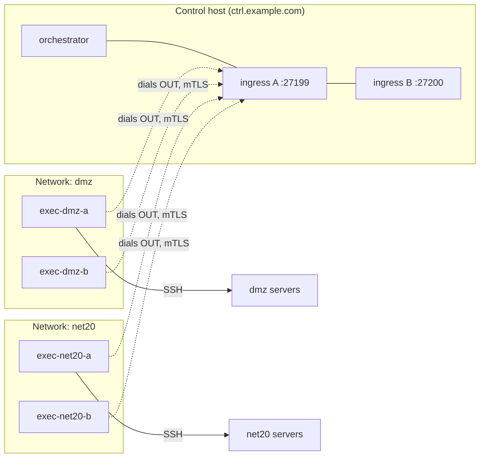

# Deploying the mesh with your own (corporate) CA

A complete, hand-it-to-anyone walkthrough for standing up the distributed
execution mesh when **your organization's PKI signs the certificates** instead
of the repo's offline CA scripts. It assumes no prior knowledge of this
project: every directory is created, every file is written out in full, and
every command says which machine it runs on.

If you *don't* have a corporate CA, use the repo-CA path instead:
[README — Setting up for real](README.md#setting-up-for-real) and the
[RUNBOOK](RUNBOOK.md). The mesh itself is identical either way — the only
difference is who signs the certificate signing requests (CSRs).

---

## What you are building

One **control host** runs the orchestrator and two ingress endpoints.
**Execution nodes** — plain VMs inside networks the control host cannot reach —
each run one container that dials **out** to the control host and runs
playbooks against the servers in its own network. Nothing ever dials into a
node network; the only firewall change is one outbound rule per node.



This guide deploys **2 networks × 2 nodes each** for dispatch failover.
For more or fewer networks, repeat or drop the per-node steps — nothing else
changes.

## Placeholders — replace these everywhere

Every command below uses these example values. Do a mental (or literal)
search-and-replace with your real ones before running anything.

| Placeholder | Meaning | Yours |
|---|---|---|
| `ctrl.example.com` | DNS name (or IP) of the control host, **as the node VMs can resolve/reach it** | |
| `vX.Y.Z` | The release you are deploying — pick the latest from the [Releases page](https://github.com/allamiro/ansible-controller/releases) | |
| `exec-dmz-a`, `exec-dmz-b`, `exec-net20-a`, `exec-net20-b` | Node IDs. Letters, digits, `.` `_` `-` only. The ID is baked into the certificate — pick names you will keep | |
| `dmz`, `net20` | Your network segment names (used for pools/zones and inventory files) | |
| `mesh-ca.pem` | The mesh trust anchor installed on every endpoint — see [Part 1](#part-1--what-to-ask-your-pki-team) | |
| `corp-chain.pem` | Your CA's full chain, used only for admin-side `openssl verify` — see [Part 1](#part-1--what-to-ask-your-pki-team) | |

## The machines and what each one needs

| Machine | Count | OS | Must have installed |
|---|---|---|---|
| Control host | 1 | Linux x86_64/arm64 | Docker Engine + `docker compose` plugin, `git`, `make`, `openssl`; `cosign` recommended |
| Execution node | 4 (2 per network) | Linux x86_64/arm64 | Docker Engine + `docker compose` plugin, `openssl`, `curl` |
| Secure admin workstation | 1 (can be a laptop) | Linux/macOS | `openssl` only |
| Your targets | existing servers | any | nothing new — just SSH access from their local node |

Install Docker per the [official instructions](https://docs.docker.com/engine/install/)
for your distribution, then confirm on each host:

```bash
docker --version && docker compose version
```

### Do the execution nodes need Docker (or Podman)?

**Yes — every execution node needs a container runtime**, because the node
*is* a container (`ghcr.io/allamiro/ansible-execution-node`). Nothing else
from this project is installed on the node VM; Ansible, Receptor, and Python
all live inside that image.

- **Docker Engine + the compose plugin is the tested, recommended path** —
  the repo's e2e suite starts nodes from the exact compose file you'll use.
- **Podman (≥ 4) can work** but is not CI-tested here. Use the
  `docker run` equivalent documented inside
  [`compose.node.yml`](compose.node.yml)'s header / the
  [RUNBOOK enrollment step](RUNBOOK.md#2-enroll-an-execution-node) under a
  systemd unit or quadlet, and note two gaps: `--restart unless-stopped`
  needs `podman-restart.service` enabled to survive reboots, and you lose
  compose's `up --wait` health gating (check
  `podman healthcheck run <container>` yourself).

Pick one runtime per host — don't mix.

---

## Part 1 — What to ask your PKI team

Receptor certificates are **not ordinary server certificates**. Get written
confirmation of these four points before generating anything, and test with a
single CSR before doing all six:

1. **The CA must sign CSRs preserving the requested Subject Alternative Name
   (SAN) extensions verbatim** — including a non-standard
   `otherName` SAN with OID **`1.3.6.1.4.1.2312.19.1`** (the Receptor node
   ID). This is the identity the mesh checks on every connection; a
   technically valid certificate without it is refused. Many corporate CAs
   (Microsoft ADCS in particular) strip or rewrite SANs by default — on ADCS
   the template must allow subject information to be *supplied in the
   request*.
2. **Ask for a dedicated issuing intermediate for the mesh** if at all
   possible. What you install as the trust anchor decides who can join — if
   it's your whole corporate root, then *anyone* who can obtain a corp
   certificate carrying a receptor `otherName` can join your mesh. A
   mesh-only intermediate keeps the blast radius small.
3. **Key usage**: `digitalSignature, keyEncipherment`; extended key usage
   **both** `serverAuth` and `clientAuth` (nodes are TLS clients dialing out;
   the ingresses are servers; one profile serves all identities).
4. **Get two PEM files**, and keep them apart — they have different jobs:
   - **`mesh-ca.pem`** — the mesh trust anchor: *only* the dedicated issuing
     intermediate's certificate (or the root, if that CA signs the mesh certs
     directly). This is what gets installed as `ca.crt` on every mesh
     endpoint. Do **not** include the parents up to a shared corporate root
     here — that would make the shared root a trust anchor and reopen the
     door point 2 just closed.
   - **`corp-chain.pem`** — the full chain (issuing intermediate + parents up
     to the root, concatenated). Used only for the `openssl verify` checks in
     this guide; it is never installed into any mesh bundle (`ca.crt`), and
     you can delete it from a host once its checks pass.

   Also note the certificate lifetime they issue — you own tracking expiry
   ([Part 7](#part-7--renewal-and-day-2)).

## Part 2 — Work-signing keypair (secure workstation, once)

Separate from TLS and from your CA entirely: the control plane **signs every
job** with this RSA key, and every node refuses work that isn't signed by it.
That split means a stolen/joined node still cannot *inject* work.

On the secure workstation:

```bash
mkdir -p ~/mesh-keys && cd ~/mesh-keys
openssl genpkey -algorithm RSA -pkeyopt rsa_keygen_bits:3072 -out work-private.pem
openssl pkey -in work-private.pem -pubout -out work-public.pem
chmod 600 work-private.pem
chmod 644 work-public.pem   # a restrictive umask would otherwise leave it 0600,
                            # unreadable by the node container (uid 1000)
```

Distribution rules — this is the part people get wrong:

| File | Goes to | Never goes to |
|---|---|---|
| `work-private.pem` | control host only | any execution node |
| `work-public.pem` | every execution node | — (it's public) |

Keep the originals on this workstation as the canonical copy.

## Part 3 — Control host

### 3.1 Get the repository at the pinned release

```bash
sudo mkdir -p /opt && cd /opt
sudo git clone https://github.com/allamiro/ansible-controller.git
sudo chown -R "$USER" ansible-controller && cd ansible-controller
git checkout vX.Y.Z
```

### 3.2 Point the stack at the orchestrator image

```bash
cat > orchestrator.override.yml <<'EOF'
# Site-local (gitignored). make mesh-up includes it automatically.
services:
  ansible:
    image: ghcr.io/allamiro/ansible-orchestrator:vX.Y.Z
EOF
```

Verify the image signatures before first use (recommended):

```bash
for img in ansible-orchestrator ansible-execution-node; do
  cosign verify \
    --certificate-identity-regexp 'https://github\.com/allamiro/ansible-controller/\.github/workflows/docker-publish\.yml@.*' \
    --certificate-oidc-issuer https://token.actions.githubusercontent.com \
    "ghcr.io/allamiro/$img:vX.Y.Z"
done
```

### 3.3 Generate the two control-plane CSRs

The control plane presents two identities — `controller-a` (ingress A) and
`controller-b` (ingress B). Their private keys are born here and never leave.

```bash
mkdir -p mesh/secrets/receptor/csr && cd mesh/secrets/receptor/csr

cat > controller-a.cnf <<'EOF'
[ req ]
default_bits       = 2048
prompt             = no
default_md         = sha256
distinguished_name = dn
req_extensions     = v3_req

[ dn ]
CN = controller-a

[ v3_req ]
keyUsage         = critical, digitalSignature, keyEncipherment
extendedKeyUsage = serverAuth, clientAuth
subjectAltName   = @alt_names

[ alt_names ]
DNS.1       = controller-a
DNS.2       = receptor-controller
DNS.3       = ctrl.example.com
# The Receptor node-ID SAN — the mesh's identity check. Do not remove:
otherName.1 = 1.3.6.1.4.1.2312.19.1;UTF8:controller-a
EOF

cat > controller-b.cnf <<'EOF'
[ req ]
default_bits       = 2048
prompt             = no
default_md         = sha256
distinguished_name = dn
req_extensions     = v3_req

[ dn ]
CN = controller-b

[ v3_req ]
keyUsage         = critical, digitalSignature, keyEncipherment
extendedKeyUsage = serverAuth, clientAuth
subjectAltName   = @alt_names

[ alt_names ]
DNS.1       = controller-b
DNS.2       = receptor-controller-b
DNS.3       = ctrl.example.com
otherName.1 = 1.3.6.1.4.1.2312.19.1;UTF8:controller-b
EOF

for id in controller-a controller-b; do
  openssl req -new -newkey rsa:2048 -nodes \
    -keyout "$id.key" -out "$id.csr" -config "$id.cnf"
  chmod 600 "$id.key"
done
```

(`DNS.2` is the in-compose alias each ingress answers on; `DNS.3` is the name
your nodes dial. If your CA requires larger keys, raising `default_bits`/
`rsa:2048` to 3072 or 4096 is fine everywhere in this guide.)

**Send `controller-a.csr` and `controller-b.csr` to your CA.** Send only the
`.csr` files — never a `.key`.

### 3.4 Verify what comes back, then assemble the bundles

For **each** returned certificate — this replaces the identity check the
repo's own CA would have enforced:

```bash
openssl x509 -in controller-a.crt -noout -text | grep -EA4 "Subject Alternative Name"
#  MUST show exactly ONE othername, for OID 1.3.6.1.4.1.2312.19.1, ending in
#  the identity — e.g. "othername: 1.3.6.1.4.1.2312.19.1:controller-a".
#  (The number of colons before the id varies by openssl version — only the
#  OID and the id matter.)  And no DNS names beyond the three you requested.
openssl verify -CAfile /path/to/corp-chain.pem -purpose sslserver controller-a.crt
#  -purpose sslserver also catches a CA template that dropped the requested
#  EKUs — a chain-only check would still say OK for a cert mTLS will reject.
```

If the `othername` line is missing, your CA rewrote the SANs — go back to
[Part 1](#part-1--what-to-ask-your-pki-team), point 1. Do not install the
certificate.

Assemble (from the repository root, `/opt/ansible-controller`):

```bash
mkdir -p mesh/secrets/receptor/issued/controller-a \
         mesh/secrets/receptor/issued/controller-b \
         mesh/secrets/receptor/work-signing

# ca.crt is the mesh trust anchor ONLY (mesh-ca.pem) — never the full
# corporate chain; see Part 1, point 4:
cp mesh/secrets/receptor/csr/controller-a.crt mesh/secrets/receptor/issued/controller-a/tls.crt
cp mesh/secrets/receptor/csr/controller-a.key mesh/secrets/receptor/issued/controller-a/tls.key
cp /path/to/mesh-ca.pem                       mesh/secrets/receptor/issued/controller-a/ca.crt

cp mesh/secrets/receptor/csr/controller-b.crt mesh/secrets/receptor/issued/controller-b/tls.crt
cp mesh/secrets/receptor/csr/controller-b.key mesh/secrets/receptor/issued/controller-b/tls.key
cp /path/to/mesh-ca.pem                       mesh/secrets/receptor/issued/controller-b/ca.crt

# work-private.pem from Part 2 (scp it from the secure workstation):
cp /path/to/work-private.pem mesh/secrets/receptor/work-signing/work-private.pem

chmod 600 mesh/secrets/receptor/issued/controller-*/tls.key \
          mesh/secrets/receptor/work-signing/work-private.pem
```

### 3.5 Start the control plane

```bash
make mesh-up
docker ps          # expect: ansible-controller (orchestrator image),
                   #         receptor-controller, receptor-controller-b
```

Open the firewall: node networks → `ctrl.example.com` TCP **27199** and
**27200**, outbound from the nodes' side. Nothing inbound to the nodes.

## Part 4 — Each execution node (repeat ×4)

Shown for `exec-dmz-a`; repeat with the right ID for `exec-dmz-b`,
`exec-net20-a`, `exec-net20-b`.

### 4.1 Create the directory layout

```bash
sudo mkdir -p /opt/mesh-node && sudo chown "$USER" /opt/mesh-node && cd /opt/mesh-node
mkdir -p secrets/receptor/csr \
         secrets/receptor/issued/exec-dmz-a \
         secrets/receptor/work-signing
```

### 4.2 Generate this node's key and CSR — the key never leaves this VM

```bash
cd /opt/mesh-node/secrets/receptor/csr

cat > exec-dmz-a.cnf <<'EOF'
[ req ]
default_bits       = 2048
prompt             = no
default_md         = sha256
distinguished_name = dn
req_extensions     = v3_req

[ dn ]
CN = exec-dmz-a

[ v3_req ]
keyUsage         = critical, digitalSignature, keyEncipherment
extendedKeyUsage = serverAuth, clientAuth
subjectAltName   = @alt_names

[ alt_names ]
DNS.1       = exec-dmz-a
# The Receptor node-ID SAN — the mesh's identity check. Do not remove:
otherName.1 = 1.3.6.1.4.1.2312.19.1;UTF8:exec-dmz-a
EOF

openssl req -new -newkey rsa:2048 -nodes \
  -keyout exec-dmz-a.key -out exec-dmz-a.csr -config exec-dmz-a.cnf
chmod 600 exec-dmz-a.key
```

**Send `exec-dmz-a.csr` to your CA.** Only the `.csr`.

### 4.3 Verify the returned certificate, then assemble the bundle

```bash
cd /opt/mesh-node/secrets/receptor
openssl x509 -in csr/exec-dmz-a.crt -noout -text | grep -EA4 "Subject Alternative Name"
#  MUST show exactly ONE othername, for OID 1.3.6.1.4.1.2312.19.1, ending in
#  "exec-dmz-a" (colon count before the id varies by openssl version), and
#  no DNS name other than exec-dmz-a.
openssl verify -CAfile /path/to/corp-chain.pem -purpose sslclient csr/exec-dmz-a.crt
#  -purpose sslclient also catches a CA template that dropped the requested
#  EKUs — the node authenticates as a TLS client, and a chain-only check
#  would still say OK for a cert mTLS will reject.

cp csr/exec-dmz-a.crt        issued/exec-dmz-a/tls.crt
cp csr/exec-dmz-a.key        issued/exec-dmz-a/tls.key
# the mesh trust anchor ONLY (mesh-ca.pem) — never the full corporate chain:
cp /path/to/mesh-ca.pem      issued/exec-dmz-a/ca.crt
# work-public.pem from Part 2 (the PUBLIC half — never work-private.pem):
cp /path/to/work-public.pem  work-signing/work-public.pem

chmod 600 issued/exec-dmz-a/tls.key
chmod 644 work-signing/work-public.pem      # must be readable by uid 1000
sudo chown -R 1000:1000 issued/exec-dmz-a   # the container reads the bundle as uid 1000
```

### 4.4 Configure and start the node

Fetch the packaged compose file for the release you deployed, then write the
node's `.env`:

```bash
cd /opt/mesh-node
curl -fsSLo compose.node.yml \
  https://raw.githubusercontent.com/allamiro/ansible-controller/vX.Y.Z/mesh/compose.node.yml

cat > .env <<'EOF'
RECEPTOR_NODE_ID=exec-dmz-a
RECEPTOR_PEERS=ctrl.example.com:27199,ctrl.example.com:27200
MESH_NODE_IMAGE=ghcr.io/allamiro/ansible-execution-node:vX.Y.Z
EOF

docker compose -f compose.node.yml up -d --wait
docker compose -f compose.node.yml logs | tail -20   # both ingress connections up, no TLS errors
```

`up --wait` returns only when the node is *healthy* (the image carries a
receptor healthcheck), and the container restarts with the host. If the logs
show certificate errors, re-run the 4.3 verification — the answer is in the
SANs virtually every time.

## Part 5 — Tell the dispatcher about your nodes (control host)

Pools are ordered failover lists with per-node concurrency caps; zones are the
friendly names you dispatch with. Both files are read per dispatch — editing
them needs no restart.

```bash
cd /opt/ansible-controller

cat > mesh/config/pools.yml <<'EOF'
pools:
  dmz:
    - { node: exec-dmz-a,   max_concurrent: 2 }
    - { node: exec-dmz-b,   max_concurrent: 2 }
  net20:
    - { node: exec-net20-a, max_concurrent: 2 }
    - { node: exec-net20-b, max_concurrent: 2 }
EOF

cat > mesh/config/zones.yml <<'EOF'
zones:
  dmz:   { pool: dmz }
  net20: { pool: net20 }
EOF
```

## Part 6 — Verify everything, then run the first playbook

### 6.1 The mesh itself

```bash
cd /opt/ansible-controller
make mesh-status                    # all four nodes listed under Known Nodes
make mesh-ping NODE=exec-dmz-a      # repeat for all four
```

### 6.2 SSH access from node to targets

The node reaches its targets over ordinary SSH. Put the private key for the
targets on the **control host** (it is delivered to the node per job, never
stored there), and an inventory describing the targets:

```bash
cd /opt/ansible-controller
mkdir -p ssh                     # gitignored — a fresh clone doesn't have it
cp /path/to/your-target-key ssh/id_ed25519
chmod 700 ssh && chmod 600 ssh/id_ed25519

cat > configs/inventory/dmz.ini <<'EOF'
[dmz]
10.20.0.11
10.20.0.12

[dmz:vars]
ansible_user=ansible
EOF
```

Each target must already trust the matching public key
(`~ansible/.ssh/authorized_keys` on the target).

### 6.3 Dispatch

```bash
make mesh-run ZONE=dmz PLAYBOOK=ping.yml INVENTORY=inventory/dmz.ini \
  SSH_KEY=/home/ansible/.ssh/id_ed25519 WAIT=120
```

What the arguments mean: `PLAYBOOK` is relative to the repo's `playbooks/`
directory (`ping.yml` ships with it), `INVENTORY` is relative to `configs/`,
and `SSH_KEY` is the *container* path — the repo mounts `./ssh` at
`/home/ansible/.ssh`. You get live output, the playbook's real exit code in
`$?`, and artifacts under `logs/runner/<job-id>/` — `meta.json` in there
records which node actually ran it.

**Success looks like:** `ok=...` from the ping tasks, exit code 0, and
`meta.json` naming `exec-dmz-a` or `exec-dmz-b`.

## Part 7 — Renewal and day-2

- **Certificate expiry is now on your calendar, not the repo's.** Corporate
  leaves are often ≤ 1 year. An expired node cert looks like a node that
  silently vanished from `mesh-status`. Check any bundle with:
  `openssl x509 -in tls.crt -noout -enddate`. Renewal = same CSR flow
  (regenerating the key too is better hygiene and costs nothing), verify the
  SANs, replace `tls.crt`(+`tls.key`), then
  `docker compose -f compose.node.yml up -d --force-recreate --wait` —
  `--force-recreate` matters: receptor loads its credentials at startup, and
  a plain `up` leaves the running container (and the old certificate) in
  place because nothing in the compose config changed.
- **Work-signing rotation, node eviction, troubleshooting**: the
  [RUNBOOK](RUNBOOK.md) applies unchanged from §3 onward — only its signing
  steps are replaced by your CA.
- **Upgrades** (new release of this repo): [RUNBOOK §8](RUNBOOK.md#8-upgrade),
  unchanged.
- **A job that ends `results-incomplete`** is recovered — never re-executed —
  with `make mesh-collect JOB=<job-id>`.

## Final checklist

- [ ] PKI team confirmed SAN-preserving signing (incl. OID `1.3.6.1.4.1.2312.19.1`) and provided both `mesh-ca.pem` (trust anchor) and `corp-chain.pem` (verification chain)
- [ ] Every installed `ca.crt` is `mesh-ca.pem` only — no shared corporate root on any mesh host
- [ ] Work-signing pair created; private half on control host **only**, public half on every node
- [ ] Control host: repo at `vX.Y.Z`, `orchestrator.override.yml` written, images cosign-verified
- [ ] Both controller certs verified (`othername` + chain) and assembled under `mesh/secrets/receptor/issued/`
- [ ] Every node: key born on the node, cert verified, bundle owned by uid 1000, `.env` written, container **healthy**
- [ ] Firewall: nodes → control host TCP 27199/27200 outbound; nothing inbound
- [ ] `pools.yml` / `zones.yml` list all nodes
- [ ] `make mesh-status` shows all nodes; `mesh-ping` round-trips each
- [ ] First playbook ran; `meta.json` names the executing node
- [ ] Certificate expiry dates recorded in your monitoring/calendar
