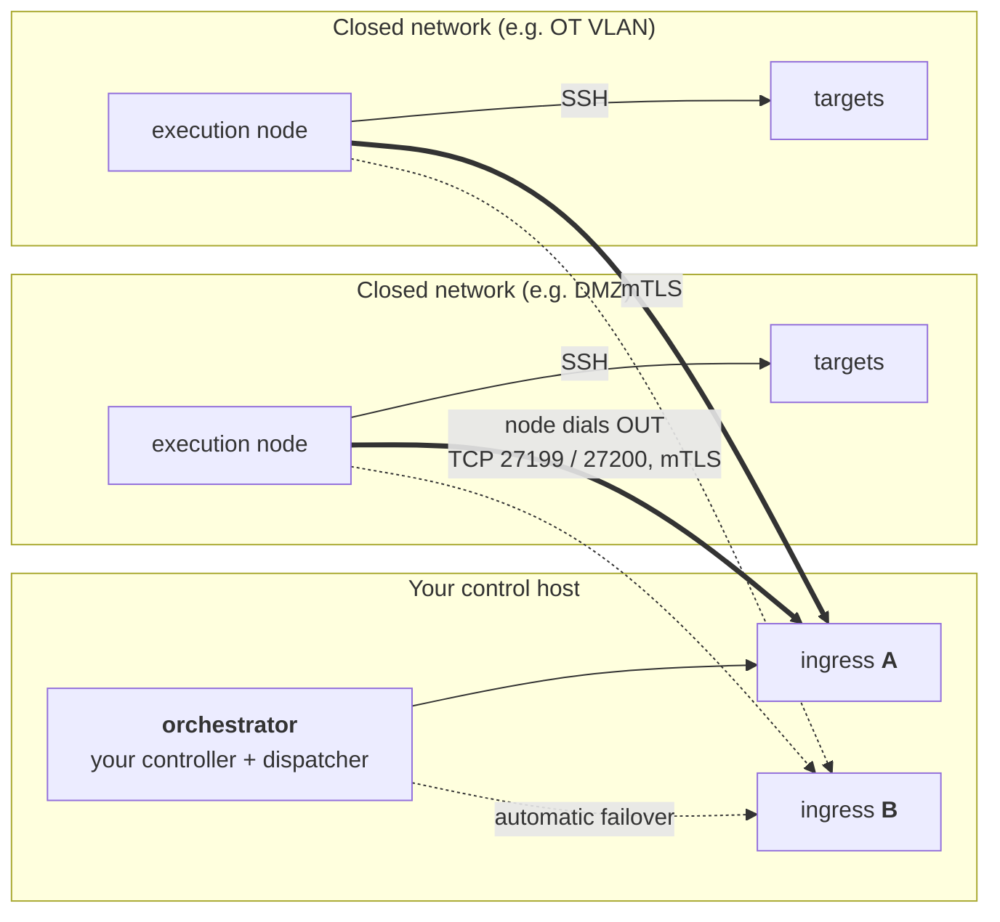
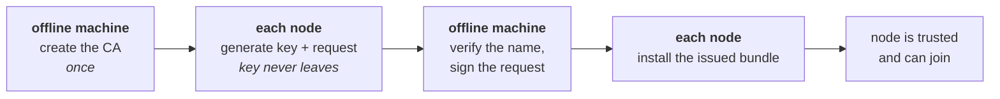

# Distributed Execution Mesh

> Run your playbooks inside networks your controller can't reach.

[](https://github.com/allamiro/ansible-controller/actions/workflows/mesh-image.yml)


The [Ansible controller](../README.md) runs playbooks directly, which means it
needs a network route to every target. Real networks don't always allow that:
DMZs, OT segments, isolated VLANs, and remote sites are often unreachable from
the machine you work on — by design.

The mesh solves this by placing a small **execution node** inside each closed
network. You keep working on the controller exactly as before; when a target
lives behind a wall, you hand the job to the node inside that wall. The node
runs the playbook locally over SSH and streams the output back to you over an
encrypted, certificate-authenticated channel. No inbound firewall holes, no
VPN, no agent on the targets.

## Do you need it?

| Your situation | What to use |
|---|---|
| The controller can SSH to all your targets | The controller alone — `make run`, nothing to set up ([main README](../README.md)) |
| Some targets sit in networks the controller cannot route to | The mesh, for those targets — everything else keeps working unchanged |

The mesh is strictly **opt-in**: `make up` never starts any part of it, and
enabling it changes nothing about how direct runs behave.

## How it works



Four properties you can rely on (each one is re-proven automatically by the
project's test suite on every change):

1. **No certificate, no entry.** Every connection is authenticated in *both*
   directions with certificates you issue yourself. A machine with no
   certificate, an expired one, one from a different authority, or a valid
   certificate for the wrong identity is refused at the door.
2. **Nodes dial out.** Nothing ever connects *into* your protected network.
   The execution node opens outbound TCP connections to your control host
   (ports 27199 and 27200, one per ingress) and receives all its work over
   them. Your inbound firewall rules stay exactly as they are.
3. **The master key stays offline.** The Certificate Authority key that mints
   identities lives on a machine that never joins the mesh — stealing any
   running container gets an attacker one identity, never the ability to
   create identities.
4. **One door can fail.** The control host runs two ingress endpoints (A and
   B). Nodes stay connected to both; if A goes down, **new** jobs dispatch
   through B, and A re-joins automatically when it returns. A job that was
   already streaming through A when it died follows the never-run-twice rule
   below: check its artifacts and re-run by hand if safe — it is reported
   incomplete rather than silently resubmitted.

Targets need nothing installed — the execution node reaches them over plain
SSH, exactly the way the controller does on the direct path.

## Try it in ten minutes

Before touching any real network, stand up the complete system in miniature on
one machine — orchestrator, both ingress endpoints, an execution node, and a
target that the control plane genuinely cannot route to — and watch a playbook
cross the wall:

```bash
docker build -f docker/Dockerfile -t ansible-controller:dev .   # 1. the controller base
mesh/tests/e2e-up.sh ansible-controller:dev                     # 2. build + start the lab (throwaway certificates issued for you)
mesh/tests/e2e-check.sh                                         # 3. watch 24 checks prove every property above
mesh/tests/e2e-down.sh                                          # tear it all down again
```

Step 3 dispatches real playbooks through the mesh and also proves the
*negative* space: it tries to join with missing, expired, wrong-identity, and
wrong-authority certificates and confirms each one is refused, then stops
ingress A and confirms a fresh dispatch still succeeds through B — and that A
re-joins when restarted.

This lab is the complete distributed path end to end, and it is the supported
way to run the full path today (see [What ships today](#what-ships-today-and-whats-next)).

## Setting up for real

### What you'll need

- **Control host** — the machine already running your controller via
  `docker compose`.
- **One Linux + Docker host per closed network** — it must be able to reach
  your targets over SSH *inside* the network, and to open outbound TCP
  connections to your control host on ports 27199 and 27200. That's its only
  requirement.
- **An offline machine for the CA** — anything that stays off the network
  (a laptop, a VM you keep powered off). It holds the one key that can issue
  mesh identities. It needs Docker: the PKI scripts run receptor's own
  certificate tooling inside the pinned receptor image, so preload that image
  before disconnecting the machine:

  ```bash
  # on a connected machine (image ref pinned in mesh/pki/common.sh):
  docker pull quay.io/ansible/receptor:v1.6.7@sha256:6296f6cd3b0301cc7c9376e48ae15a42fc7b606235d08e94543fe77661cea4d2
  docker save quay.io/ansible/receptor:v1.6.7@sha256:6296f6cd3b0301cc7c9376e48ae15a42fc7b606235d08e94543fe77661cea4d2 -o receptor.tar
  # transfer receptor.tar to the CA machine, then there:
  docker load -i receptor.tar
  ```

### Step 1 — issue identities

Every participant gets a certificate before it may join. The scripts in
[`mesh/pki/`](pki/) do all the OpenSSL-free heavy lifting; you only decide
names.



```bash
# ON THE OFFLINE MACHINE — once. Then keep ca.key there, and only there.
mesh/pki/mesh-ca-init.sh "my mesh CA"

# ON THE OFFLINE MACHINE — one identity for each ingress endpoint (A and B):
mesh/pki/controller-cert.sh controller-a receptor-controller
mesh/pki/controller-cert.sh controller-b receptor-controller-b

# ON EACH EXECUTION NODE — generate its key and signing request.
# The private key is born here and never leaves this machine:
mesh/pki/node-csr.sh exec-dmz-a

# ON THE OFFLINE MACHINE — sign the request (refuses a request whose name
# doesn't exactly match the node you're authorising):
mesh/pki/node-sign.sh csr/exec-dmz-a.csr exec-dmz-a

# BACK ON THE NODE — assemble the bundle the node will mount: copy the
# returned issued/exec-dmz-a/ (tls.crt + ca.crt) into the node's secrets
# store, then add the private key that never left this machine:
cp csr/exec-dmz-a.key issued/exec-dmz-a/tls.key
chmod 600 issued/exec-dmz-a/tls.key
```

A complete bundle is `issued/<name>/` holding `tls.crt`, `tls.key`, and
`ca.crt`. The two controller identities are born complete on the offline
machine — copy those `issued/controller-*/` directories to the control host.
Everything lives under `mesh/secrets/` (gitignored — never committed);
running containers only ever see `issued/<name>/` directories, never the CA
key.

**Naming tip:** node names become the addresses you dispatch to
(`mesh-run --node exec-dmz-a ...`), so name nodes after their network:
`exec-dmz-a`, `exec-ot-b`, and so on.

### Step 2 — start the control plane

On the control host:

```bash
docker compose -f docker-compose.yml -f mesh/compose.mesh.yml --profile mesh up -d
```

This starts both ingress endpoints beside your controller and connects the
control socket. Ingress A listens on host port **27199** and ingress B on
**27200** — the two ports your nodes dial. Your existing controller, its
mounts, and the direct execution path are untouched — omit `--profile mesh`
and none of this exists.

**To dispatch from this host you also need the orchestrator image** — the
stock controller deliberately carries no `receptorctl`/`mesh-run`. Point the
`ansible` service at the published image (see
[Getting the images](#getting-the-images)):

```yaml
# orchestrator.override.yml — add as one more -f file on the compose command
services:
  ansible:
    image: ghcr.io/allamiro/ansible-orchestrator:latest
```

### Step 3 — connect your execution nodes

Run the execution-node image on the host inside each closed network with its
issued certificate bundle mounted; it dials out to your control host on ports
27199 (ingress A) and 27200 (ingress B) and appears in the mesh. The packaged
wiring for this step — published images, a ready-made node compose file, and
`make mesh-run` / `make mesh-status`
targets — is the part still landing (see
[What ships today](#what-ships-today-and-whats-next)); until it does, the
[lab](#try-it-in-ten-minutes) shows the complete working wiring you can adapt,
and `mesh/tests/e2e.compose.yml` is a faithful reference for the node side.

## Running a job

Jobs are dispatched from inside the orchestrator container with `mesh-run`
(the lab mounts it at `/usr/local/mesh/bin/mesh-run`; a `make mesh-run`
shortcut is on the roadmap):

Paths are container paths: with the production overlay your playbooks and
inventory are mounted under `/configs`, same as direct runs:

```bash
/usr/local/mesh/bin/mesh-run --node exec-dmz-a \
                             --playbook /configs/playbooks/site.yml \
                             --inventory /configs/inventory/dmz.ini \
                             [--ssh-key /path/to/key]
```

What you get back:

- **Live output** — the playbook's events stream back to your terminal as it
  runs on the node.
- **The real exit code** — `mesh-run` exits with the playbook's actual result,
  read from the run's own record, so scripts and CI can trust `$?`.
- **A job directory** — every run gets a unique ID and a directory under
  `/var/lib/mesh/jobs/<uuid>/` (override with `--jobs-dir`) containing the
  full stdout, the per-task event log, and a `meta.json` describing the run
  with timestamped status transitions. Concurrent jobs never collide.
- **Artifacts on the host** — the operator-facing set (stdout, `rc`, `status`,
  `job_events/`, final `meta.json`) is also copied to
  `/var/log/ansible/runner/<uuid>/`, which the compose setup exposes on the
  host as `logs/runner/<uuid>/` — read results without entering a container.
- **Credential hygiene** — a key passed with `--ssh-key` travels only inside
  the encrypted mesh stream, is never logged or placed in an environment
  variable, and every transient copy is removed when the job ends (the
  controller-side copy gets a best-effort overwrite before deletion — note
  that overwrite guarantees don't hold on CoW/flash storage, so point
  `--jobs-dir` at a tmpfs if the disk below it gets imaged; the node-side
  copy is destroyed by the worker itself the moment execution finishes, even
  if the controller never reconnects).

**A job never runs twice.** If a submission provably failed to leave the
control host, it can be retried elsewhere — but once a node has (or even *may*
have) accepted it, it is never re-sent. A network blip mid-job can cost you a
retry you do by hand; it can never silently run your playbook twice.

### Pools and zones

Instead of naming a node, let the dispatcher pick a healthy one. Declare
pools (ordered candidate nodes with per-node concurrency caps) and zones
(friendly names mapping to pools) in [`mesh/config/pools.yml`](config/pools.yml)
and [`zones.yml`](config/zones.yml), mount them at `/etc/mesh/` in the
orchestrator, and dispatch by zone or pool:

```bash
/usr/local/mesh/bin/mesh-run --zone dmz --playbook ... --inventory ...
/usr/local/mesh/bin/mesh-run --pool net20 --playbook ... --inventory ...
```

What the dispatcher guarantees:

- **Failover only before submission.** A candidate is skipped for the next
  one only while nothing has left the control host — it isn't routable via
  any live ingress, or all its slots are taken. Once a submit is attempted
  there is exactly one submission; the never-runs-twice rule above is never
  bent for failover.
- **Concurrency caps that can't race.** `max_concurrent` per node is enforced
  by an atomic lock reservation held for the job's lifetime — two dispatchers
  can't both squeeze into the last slot, and a crashed dispatcher's slot
  frees itself. When every candidate is saturated the dispatch is refused
  with "nothing was executed" — re-run it when a slot frees.
- **The record shows the choice.** `meta.json` carries both the pool and the
  node that actually served the job.

## Node runtime Python dependencies

If your playbooks use plugins that need Python packages on the machine running
Ansible — cloud inventory SDKs like `boto3` are the classic case — those
packages must exist **on the execution node**, since that's where the playbook
runs. They are deliberately *not* shipped per job (staging compiled packages
through the job stream is the wrong layer: slow, arch-specific, and
unauditable). Extend the node image once instead, exactly the way the
controller bakes its own dependencies:

```dockerfile
# Dockerfile.site-node
FROM ghcr.io/allamiro/ansible-execution-node:latest
USER root
COPY node-requirements.txt /tmp/node-requirements.txt
RUN pip3 install --no-cache-dir --break-system-packages -r /tmp/node-requirements.txt \
 && rm /tmp/node-requirements.txt
USER ansible
```

```bash
docker build -f Dockerfile.site-node -t ansible-execution-node:site .
# run this tag on your node hosts
```

Pin versions in `node-requirements.txt` and rebuild the site image when the
base updates — nodes stay reproducible and every dependency is visible in one
file.

---

## Health and troubleshooting

Check what the mesh can see (inside the orchestrator container):

```bash
receptorctl --socket /run/receptor/receptor.sock status     # via ingress A
receptorctl --socket /run/receptor/receptor-b.sock status   # via ingress B
```

A healthy mesh lists every execution node in `Known Nodes` with a route, and
each node advertises the work type that runs playbooks.

| Symptom | Likely cause | What to do |
|---|---|---|
| Node missing from `status` | It can't reach ports 27199/27200 on the control host, or its TLS bundle is wrong | From the node's host: test outbound reachability to the control host; check the node's logs — a refused TLS handshake means a certificate problem (next row) |
| Node's connection is refused | Expired certificate, wrong identity in the certificate, or a bundle issued by a different CA | Re-issue: new request on the node (`node-csr.sh`), sign offline (`node-sign.sh`), install the new bundle, restart the node. This is deliberate — an unauthenticated node must never join |
| Ingress A is down | One door failed; the other is up | New dispatches flow through B automatically. A job that was mid-stream on A is reported incomplete — check its artifacts, re-run if safe. Restart A when convenient; nodes re-attach automatically |
| Playbook failed on the node | The playbook itself failed — the mesh reports honestly | Read the `/var/lib/mesh/jobs/<uuid>/` artifacts: full stdout and per-task events are there, same as a local run |
| `mesh-run` refuses to retry a job whose outcome is unknown | The never-run-twice rule (above) | Check the job's artifacts / the target's state, then re-run by hand if it's safe |

## Getting the images

Three images make up the system, each layered directly on the exact controller
release you already run:

| Image | What it is | Runs where |
|---|---|---|
| `ansible-controller` | The stock controller — completely unchanged | Control host |
| `ansible-orchestrator` | Controller + the dispatcher (`mesh-run`, `receptorctl`) | Control host |
| `ansible-execution-node` | Orchestrator + the mesh agent (hardened build, no SSH server) | Inside each closed network |

All three ship per release to Docker Hub and GHCR — multi-arch, cosign-signed,
Trivy-gated — with the mesh images built `FROM` the exact controller digest
pushed by the same run:

```bash
docker pull ghcr.io/allamiro/ansible-orchestrator:latest
docker pull ghcr.io/allamiro/ansible-execution-node:latest
```

Prefer building from your checkout instead? The
[lab scripts](#try-it-in-ten-minutes) do exactly that with
`docker/mesh/Dockerfile` (targets `orchestrator` and `execution-node`).
Verify a pulled image the same way as the controller:

```bash
cosign verify \
  --certificate-identity-regexp 'https://github\.com/allamiro/ansible-controller/\.github/workflows/docker-publish\.yml@.*' \
  --certificate-oidc-issuer https://token.actions.githubusercontent.com \
  ghcr.io/allamiro/ansible-orchestrator:latest
```

## What ships today, and what's next

**Working now** — the full distributed path in the [lab](#try-it-in-ten-minutes)
(dispatch → mTLS mesh → execution node → artifacts back, with ingress
failover); the PKI toolchain for real identities; the control-plane overlay on
your compose setup; published, signed images for all three roles; per-job
credential hygiene and host-visible artifacts; pool/zone dispatch with
per-node concurrency caps and dispatch-only failover.

**Landing next** — packaged node deployment, `make mesh-run` / `make
mesh-status`, and work signing. The full plan and its progress live in the
[DESIGN.md checklist](DESIGN.md#7-to-do-checklist).

## Where things live

```text
mesh/
├── README.md          # this guide
├── DESIGN.md          # the deep end: architecture decisions, HA tiers, test matrix
├── compose.mesh.yml   # control-plane overlay (opt-in via --profile mesh)
├── bin/mesh-run       # the job dispatcher
├── config/receptor/   # ingress endpoint configs (A and B)
├── pki/               # certificate tooling: CA, node requests, signing
├── secrets/           # your issued bundles (gitignored; CA key stays offline)
└── tests/             # the ten-minute lab + its 24-check verification suite
```

Want the reasoning behind the design — why the failover boundary sits where it
does, the HA tiers, the full threat model? That's
[**DESIGN.md**](DESIGN.md). This page is everything you need to *run* it.
