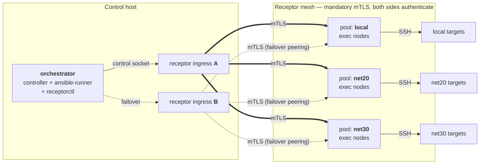
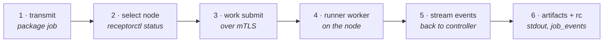
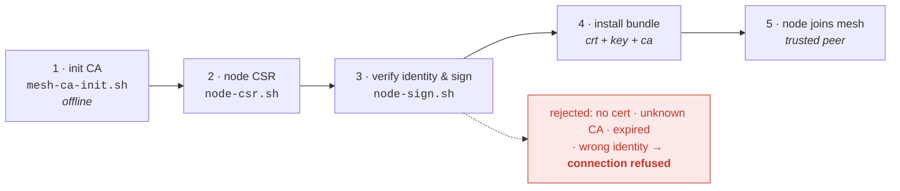
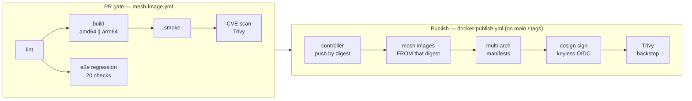

# Distributed Execution Mesh

> Dispatch Ansible jobs to execution nodes in segmented networks — over a
> mutually-authenticated Receptor mesh.

[](https://github.com/allamiro/ansible-controller/actions/workflows/mesh-image.yml)


The mesh adds a **second execution path** to the
[Ansible controller](../README.md). The direct path (`make run`) is untouched:
the controller still executes Ansible itself. The distributed path turns the
controller into an **orchestrator** that hands work to **execution nodes**
living inside the networks it cannot reach — built on
[Receptor](https://github.com/ansible/receptor) + Ansible Runner + mutual TLS,
and nothing else (no web UI, API, database, broker, or scheduler).

| Path | Command | Executes on | Reaches |
|---|---|---|---|
| **Direct** (existing) | `make run` | the controller | networks the controller can route to |
| **Distributed** (this) | `mesh-run` | an execution node | segmented networks only the node can route to |

This README is the operator overview. The full design of record — HA tiers,
failover-boundary rationale, phase plan, and test matrix — is
[**DESIGN.md**](DESIGN.md).

---

## 1. Architecture

Jobs originate at the orchestrator, cross a mutually-authenticated Receptor
mesh through redundant ingress sidecars, and land on execution nodes that reach
their targets over SSH. The control plane never needs a route to any target.



Load-bearing properties, each enforced by a CI regression check (see
[§5](#5-testing)):

- **mTLS is mandatory** — a node refuses to start without cert + key + CA, and
  every identity is bound to its certificate (`node id ⇄ cert identity`).
  `insecureskipverify` / `skipreceptornamescheck` are never set.
- **Tier-1 ingress redundancy** — two receptor sidecars (A, B); nodes peer to
  both, the dispatcher fails its control socket over between them.
- **CA private key: offline only** — it never enters any runtime container;
  only issued `crt+key+ca` bundles are ever mounted.
- **Nodes dial out** — nothing connects *into* an execution node; it maintains
  an outbound peering to the ingress and receives work over that connection.

## 2. Job pipeline

A job traverses six stages between submission on the controller and artifact
collection — `mesh/bin/mesh-run` drives all of them:



Every job gets a stable UUID and a per-job `jobs/<uuid>/meta.json`
(concurrency-safe by construction), and returns the playbook's **real** exit
code — asserted from the artifacts' own `rc` file, not inferred.

> **The failover boundary** (the design's most important correctness rule):
> a submission may be retried on another node **only** if it definitively never
> left the controller. An ACKed — or *ambiguous* — submission is treated as
> possibly-running and is never re-sent. Details in
> [DESIGN.md §2.4](DESIGN.md#24-dispatch--failover-flow-per-job).

## 3. PKI workflow

Nodes prove their identity through a certificate chain rooted in an **offline
CA** before joining the mesh. The scripts in [`mesh/pki/`](pki/) run receptor's
own cert tooling inside the pinned image; signing is gated on the CSR carrying
*exactly* the authorised node id.



```bash
# one-time, on a machine that stays offline               (CA key never leaves it)
mesh/pki/mesh-ca-init.sh "my mesh CA"

# controller-side identities, one per ingress sidecar
mesh/pki/controller-cert.sh controller-a receptor-controller
mesh/pki/controller-cert.sh controller-b receptor-controller-b

# per execution node: CSR on the node, sign offline, install the issued bundle
mesh/pki/node-csr.sh  exec-net20-a
mesh/pki/node-sign.sh csr/exec-net20-a.csr exec-net20-a
```

All material lives under `mesh/secrets/` (gitignored — **never** committed);
containers only ever mount `issued/<name>/` bundles.

## 4. Try it

The e2e lab stands up the whole topology in miniature — orchestrator, both
ingress sidecars, an execution node, and a target the control plane has **no
route to** — then proves the mesh's properties against it:

```bash
docker build -f docker/Dockerfile -t ansible-controller:dev .   # the base
mesh/tests/e2e-up.sh ansible-controller:dev                     # build mesh images + start + issue throwaway PKI
mesh/tests/e2e-check.sh                                         # the 20-property regression suite
mesh/tests/e2e-down.sh                                          # tear down (destroys the throwaway PKI)
```

For a real deployment, the control plane comes up as a profile-gated overlay —
`make up` alone never starts any of it:

```bash
docker compose -f docker-compose.yml -f mesh/compose.mesh.yml --profile mesh up -d
```

and jobs are dispatched from inside the orchestrator:

```bash
mesh-run --node exec-net20-a \
         --playbook playbooks/ping.yml \
         --inventory configs/inventory/hosts.ini
```

`make mesh-run` / `mesh-status` convenience targets land with plan Phase 10.

## 5. Testing

Mesh CI (`.github/workflows/mesh-image.yml`) runs on every PR touching
`docker/` or `mesh/`, and the e2e suite re-proves **20 properties** each time —
positive *and* negative:

| Area | Checks (e2e #) |
|---|---|
| Topology | node joined; worktype advertised; control socket reachable; **controller has no route to the target**; node does (1–5) |
| Image posture | receptor unprivileged PID 1; no sshd on nodes; patched CVE-clean receptor build (6–8) |
| Distributed execution | round-trip succeeds; **ran on the node, not the controller**; artifacts + `meta.json`; real nonzero rc propagates (9–13) |
| Negative mTLS | certless node, unknown client CA, wrong identity, expired cert, unknown *controller* CA — each **rejected** (14–19) |
| Tier-1 failover | sidecar A stopped → dispatch through B succeeds → A re-peers (20) |

Run it locally with the three commands in [§4](#4-try-it).

## 6. Images & publishing

Both mesh images build `FROM` the finished controller — pinned to an immutable
digest — so they inherit its exact runtime and CVE posture with zero drift, and
the controller image itself is **never modified**.

| Image | Contents | Role |
|---|---|---|
| `ansible-controller` | the existing controller | base — published pipeline unchanged |
| `ansible-orchestrator` | controller + `ansible-runner` + `receptorctl` | dispatches work |
| `ansible-execution-node` | orchestrator + `receptor` (patched source build) | runs work inside a zone |



The publish run builds the mesh images `FROM` the controller digest **it just
pushed**, so a `vX.Y.Z` orchestrator is provably layered on the `vX.Y.Z`
controller. All three ship per release to Docker Hub and GHCR with identical
tags (`latest` / `sha-*` / semver), multi-arch manifests, and cosign
signatures:

```bash
docker pull ghcr.io/allamiro/ansible-orchestrator:latest
docker pull ghcr.io/allamiro/ansible-execution-node:latest

# verify a signature (keyless, GitHub OIDC)
cosign verify \
  --certificate-identity-regexp 'https://github.com/allamiro/ansible-controller' \
  --certificate-oidc-issuer https://token.actions.githubusercontent.com \
  ghcr.io/allamiro/ansible-orchestrator:latest
```

## 7. Directory map

```text
mesh/
├── README.md          # this overview
├── DESIGN.md          # design of record: HA tiers, phase plan, test matrix
├── compose.mesh.yml   # control-plane overlay — profile-gated, opt-in only
├── bin/mesh-run       # dispatcher: transmit → submit → worker → process
├── config/receptor/   # ingress sidecar configs (A and B)
├── pki/               # CA init, controller certs, node CSR + signing
├── secrets/           # gitignored — issued bundles live here, CA key offline
└── tests/             # e2e lab + the 20-check regression suite
docker/mesh/Dockerfile # orchestrator + execution-node image targets
```

## 8. Status

| Phase | Delivered | |
|---|---|---|
| 0 | Production-safe SSH host-key checking (opt-in) | ✅ |
| 1–2 | Orchestrator image, `FROM` the untouched controller | ✅ |
| 3 | Profile-gated receptor control-plane sidecar | ✅ |
| 4 | Execution-node image + e2e regression environment | ✅ |
| 5 | Distributed execution proven end-to-end (`mesh-run`) | ✅ |
| 6 | PKI, mandatory mTLS, Tier-1 ingress redundancy | ✅ |
| 7–10 | Job credentials/artifacts, pools + failover, work signing, Make targets | planned |
| 11 | Publish orchestrator + execution-node images | in review ([#67](https://github.com/allamiro/ansible-controller/pull/67)) |

The unticked phases are plan, not code — see the
[DESIGN.md checklist](DESIGN.md#7-to-do-checklist) for exact scope.
