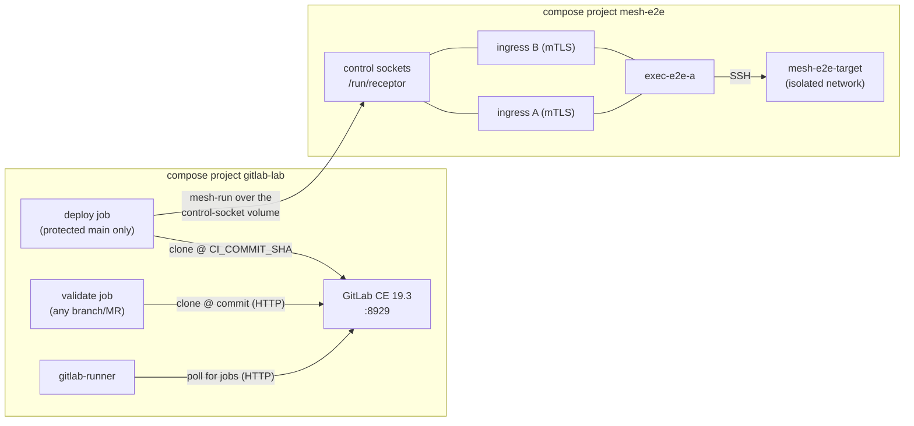

# GitLab CE integration lab

An isolated, disposable environment demonstrating the **complete lifecycle of
Git-managed Ansible automation** through the existing controller and Receptor
execution mesh: branch → merge request → validation → review → protected
merge → human-released execution on a mesh node → real results and sanitized
artifacts back in the pipeline.

Nothing here touches the production deployment files or the direct-controller
workflow. The mesh half **is** the repository's own disposable e2e
environment (`mesh/tests/`), with its throwaway CA, mandatory mTLS, and
signed work; the GitLab half is two pinned containers torn down by one
script.

## Architecture

**GitLab never contacts the controller.** There is no HTTP API, webhook
receiver, or agent in the mesh — and this lab deliberately adds none. GitLab
Runner polls GitLab (outbound HTTP) and executes pipeline jobs; the deploy
job invokes the existing `mesh-run` dispatcher, which is the one and only
execution entry point, exactly as `make mesh-run` is for a human operator.



### Who connects to whom

| # | Initiator | Destination | Protocol / port | Identity / credential | Purpose |
|---|---|---|---|---|---|
| 1 | operator / seed push | GitLab | HTTP `localhost:8929` | root PAT (disposable) | UI, API bootstrap, seed push |
| 2 | gitlab-runner | GitLab | HTTP `gitlab.lab.local:8929` | per-runner auth token | job polling, log/artifact upload |
| 3 | job containers | GitLab | HTTP `gitlab.lab.local:8929` | per-job CI_JOB_TOKEN | `git clone` at the pipeline's commit |
| 4 | deploy job → `mesh-run` | ingress A/B | **Unix socket** (`/run/receptor` volume) | socket write access = submission authority | signed work submission + result stream |
| 5 | node → ingress A and B | Receptor TCP 27199 each (in-lab; production maps A/B to host ports 27199/27200) | mutual TLS, throwaway-CA certs, node-ID SAN binding | transport, dial-out to both for failover |
| 6 | node → target | SSH 22 (isolated `targetnet`) | disposable ed25519 key, staged per job | playbook execution |

GitLab initiates **nothing** toward the mesh. The runner initiates everything
toward GitLab. The only bridge between the two compose projects is three
named volumes mounted *only* into deploy-job containers.

### Trust boundaries

| Boundary | Enforced by | Free (CE) or paid? |
|---|---|---|
| Nobody pushes `main`; only Maintainers merge | protected branch (push=no one, merge=Maintainers) | **CE** |
| Merge requires a green pipeline | "pipelines must succeed" merge check | **CE** |
| MR/branch pipelines can never reach the mesh | deploy runner is `ref_protected` — it refuses jobs from unprotected refs; validate runner has no mesh volumes, no secrets, no docker socket | **CE** |
| Deploy secrets invisible to branches | protected CI/CD variable (`DEPLOY_ALLOWED`) + the deploy script's tripwire assertion | **CE** |
| Human releases each execution | `when: manual` deploy job | **CE** |
| **Required** reviewer approval count | **not enforceable in CE** — approval *rules* are Premium; in CE approvals are optional. This lab demonstrates approval as recorded policy, with the protected branch as the technical gate | Premium |
| Mesh admission | mTLS, node-ID⇄cert SAN binding, throwaway CA (key never mounted into any runtime container) | n/a (repo) |
| Submit authority | work-signing key held by ingresses only; nodes `verifysignature` | n/a (repo) |

### Why no new API service

Every lifecycle requirement is met by runner-executed jobs calling the
existing dispatcher: validation needs a container and the repo; execution
needs the reviewed checkout plus submission authority; results are the
dispatcher's real exit code plus files. An API service would add an
always-on, network-reachable submission path — a *larger* attack surface
than the socket-scoped, protected-ref-only runner — while solving no
demonstrated problem. (A production API/webhook design remains tracked in
issue #94.)

## Requirements

- Docker Engine + compose v2, ≥ 6 GiB available RAM, ≥ 10 GB free disk,
  host port 8929 free.
- Works on FIPS-enabled hosts (RHEL/STIG): the GitLab container is not
  FIPS-capable, so the lab masks `fips_enabled` **inside that disposable
  container only** (see `compose.gitlab.yml`).

## Bring it up

```bash
mesh/labs/gitlab/lab-up.sh            # defaults to the published controller image
# or: mesh/labs/gitlab/lab-up.sh <local-controller-image>
```

This stands up the mesh e2e environment (images built from your checkout's
mesh Dockerfile against the pinned controller, PKI issued by the throwaway
CA via `mesh/pki/`), boots GitLab CE + runner, and bootstraps: root PAT,
`dev1` Developer user, the `root/mesh-automation` project seeded from
[`project-seed/`](project-seed/), protected `main`, merge checks, the
protected variable, and both runners. Credentials land in `.lab-state/`
(gitignored). The summary prints at the end; GitLab is at
<http://localhost:8929>.

## The lifecycle, step by step

1. **Change**: as `dev1`, branch from `main`, edit a playbook, push.
2. **MR**: open a merge request → the **validate** job runs (syntax check +
   ansible-lint) in a secretless container. A red pipeline blocks the merge.
3. **Review/approve**: root reviews and approves (CE records the approval;
   the *enforced* gate is that only a Maintainer can press merge).
4. **Merge** to protected `main` → the main pipeline runs validate again and
   offers the **manual deploy** job.
5. **Release execution**: a human starts `deploy`. The job (protected runner)
   stamps `$CI_COMMIT_SHA` into the play vars, refuses to dispatch if any
   prior mesh job is unresolved, then runs `mesh-run --node exec-e2e-a` from
   the reviewed checkout. The play executes **on the node**, reaches the
   target over SSH, and writes `commit=<sha>` onto the target.
6. **Results**: the pipeline job's status is the playbook's real exit code;
   sanitized artifacts (meta.json, runner rc, stdout, provenance — never
   `env/`, never keys) attach to the job.
7. **Follow-up / revert**: repeat with a revert commit — and note that
   reverting Git only restores *desired state definitions*; it does not undo
   what already ran on managed hosts. Undo is a new forward change (the lab
   demonstrates this by overwriting the target's marker with the revert
   commit's SHA).
8. **Retire**: `lab-down.sh` removes everything.

## Failure and containment demonstrations

See the acceptance table in the repository PR / audit report. Highlights
worth re-running by hand:

- **Unauthorized execution**: push a branch whose CI tries to run the deploy
  job — it sits with "no runners matching", because the deploy runner
  accepts protected refs only; the validate runner lacks the tag, volumes,
  and secrets.
- **Ingress loss**: stop one receptor sidecar; dispatch fails over to the
  other socket before submission.
- **Node loss**: stop the node; dispatch is refused pre-submit (nothing
  executed, nothing to clean up).
- **Interrupted collection**: break the result stream mid-run; the job ends
  `results-incomplete`, the **collect** job (`JOB_ID=<uuid>`) recovers the
  real rc without re-executing.
- **Cancellation** (verified, not assumed): cancelling the GitLab job
  disconnects the *caller* — the remote play ran to completion regardless.
  Observed on gitlab-runner 19.3.1 (docker executor): cancel stopped the log
  stream immediately, but the dispatcher's detached process group survived
  long enough to finish streaming results and record `succeeded`; with
  different timing the state ends `running` or `results-incomplete` instead.
  Treat cancel strictly as "disconnect", never "stop remote work". A GitLab
  job **timeout** kills the job the same way — same semantics. GitLab
  **retry** of deploy is guarded: while any tracked mesh job is non-final
  the script refuses to dispatch, so a retry cannot silently duplicate an
  operation whose outcome is unknown (and note: a retried job re-runs with
  the ORIGINAL job's variables).

## Credentials, rotation, retention

Everything is disposable and scoped to the lab: root/dev1 passwords and the
PAT in `.lab-state/` (rotate by deleting the file entries and re-running the
relevant bootstrap step, or just rebuild), per-runner tokens revocable in
the GitLab UI, the mesh SSH key and PKI live in compose volumes /
`mesh/tests/.e2e-pki` and die with `lab-down.sh --purge`. GitLab job
artifacts expire in 1 week. Nothing here is a production credential.

## Tear it down

```bash
mesh/labs/gitlab/lab-down.sh          # stacks + volumes (gitlab first, then mesh)
mesh/labs/gitlab/lab-down.sh --purge  # also delete .lab-state and the throwaway PKI
```

## What this lab does NOT demonstrate (production gaps)

- **Enforced approval counts** — Premium; in CE, pair protected branches
  with organizational review policy, or front GitLab with a bot that gates
  merges.
- HTTPS for GitLab, registry, backup/restore, GitLab upgrades.
- Real target inventories, known-hosts pinning (the lab target's host key is
  fresh per build; production follows the README's known-hosts procedure).
- Production runner topology: here the runner infrastructure container holds
  the host docker socket (standard docker-executor deployment, lab host
  only). In production, place the deploy runner on the control host (or a
  dedicated VM) exactly as issue #94 sketches, and keep it off developer
  infrastructure.
- The FIPS mask is a lab affordance; a FIPS-mandated production GitLab needs
  a FIPS-capable GitLab build, not this container.
